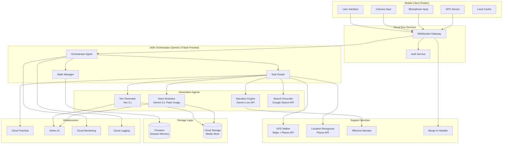
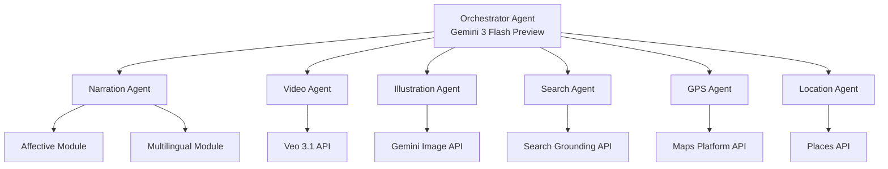

# Design Document: LORE - The World Is Your Documentary

## Overview

LORE is a multimodal Live Agent application that transforms physical locations and spoken topics into real-time, interleaved documentaries. The system leverages Google Cloud Platform services, Gemini Live API, and the Agent Development Kit (ADK) to orchestrate parallel generation of narration, video clips, illustrations, and search-grounded facts.

### System Purpose

LORE enables three distinct operating modes:
- **SightMode**: Camera-based documentary generation triggered by visual input of monuments and locations
- **VoiceMode**: Voice-based documentary generation triggered by spoken topics
- **LoreMode**: Fusion mode combining camera and voice inputs for advanced features like alternate history scenarios

### Key Capabilities

- Real-time multimodal documentary streaming with interleaved narration, video, and illustrations
- GPS-based walking tours with automatic location recognition
- Persistent session memory enabling cross-session queries
- Multi-agent orchestration using ADK for parallel content generation
- Search-grounded fact verification with source citations
- Affective narration adapting to emotional context
- Historical character encounters and alternate history scenarios
- Multilingual support across 24 languages
- Branch documentaries for exploring related sub-topics
- Chronicle export as illustrated PDF documents

### Technology Stack

- **Conversational AI**: Gemini Live API (WebSocket, vision + audio)
- **Orchestration**: Gemini 3 Flash Preview + ADK (Agent Development Kit)
- **Video Generation**: Veo 3.1 via Vertex AI
- **Illustration Generation**: Gemini 3.1 Flash Image Preview via Vertex AI
- **Search Grounding**: Google Search Grounding API
- **Backend Services**: Cloud Run (WebSocket server), Cloud Pub/Sub (async messaging)
- **Storage**: Firestore (session memory), Cloud Storage (media files)
- **Location Services**: Google Maps Platform + Places API
- **Mobile Frontend**: Flutter (iOS + Android)
- **Authentication**: Google Cloud Identity Platform
- **Monitoring**: Cloud Logging + Cloud Monitoring


## Architecture

### High-Level Architecture



### Architecture Principles

1. **Real-Time Streaming**: WebSocket-based bidirectional communication for sub-second latency
2. **Parallel Generation**: ADK orchestrates concurrent execution of narration, video, illustration, and search tasks
3. **Graceful Degradation**: System continues operating when individual components fail
4. **Stateful Sessions**: Firestore maintains persistent session memory across connections
5. **Scalable Infrastructure**: Cloud Run auto-scales based on demand
6. **Separation of Concerns**: Clear boundaries between transport (WebSocket), orchestration (ADK), generation (agents), and storage layers

### Data Flow

1. **Input Processing**: Mobile client captures camera frames, voice audio, and GPS coordinates, sending them via WebSocket
2. **Mode Detection**: Orchestrator determines active mode (SightMode/VoiceMode/LoreMode) and routes inputs accordingly
3. **Task Decomposition**: Orchestrator decomposes documentary request into parallel tasks for generation agents
4. **Parallel Generation**: Agents execute concurrently, publishing results to Pub/Sub topics
5. **Stream Assembly**: Orchestrator assembles interleaved documentary stream from agent outputs
6. **Real-Time Delivery**: WebSocket Gateway streams content to mobile client as it becomes available
7. **Persistence**: Session memory and generated media stored in Firestore and Cloud Storage


## Components and Interfaces

### 1. WebSocket Gateway (Cloud Run)

**Responsibility**: Manages real-time bidirectional communication between mobile clients and backend services.

**Key Functions**:
- Establish and maintain WebSocket connections
- Authenticate clients using Google Cloud Identity Platform
- Route incoming messages to Orchestrator
- Stream documentary content to clients
- Handle connection failures with buffering (30 second buffer)
- Support 1000+ concurrent connections

**Interface**:
```typescript
interface WebSocketGateway {
  // Connection management
  onConnect(clientId: string, authToken: string): Promise<Connection>
  onDisconnect(clientId: string): void
  
  // Message routing
  routeToOrchestrator(clientId: string, message: ClientMessage): void
  streamToClient(clientId: string, content: DocumentaryContent): void
  
  // Buffer management
  bufferContent(clientId: string, content: DocumentaryContent): void
  flushBuffer(clientId: string): void
}

interface ClientMessage {
  type: 'mode_select' | 'camera_frame' | 'voice_input' | 'gps_update' | 'barge_in' | 'query'
  payload: any
  timestamp: number
}

interface DocumentaryContent {
  type: 'narration' | 'video' | 'illustration' | 'fact' | 'transition'
  content: any
  sequenceId: number
  timestamp: number
}
```

**Performance Requirements**:
- Message latency < 100ms under normal conditions
- Support 1000+ concurrent connections
- Buffer up to 30 seconds of content during network interruptions

---

### 2. Orchestrator (ADK + Gemini 3 Flash Preview)

**Responsibility**: Coordinates multi-agent workflows for documentary generation, manages session state, and assembles interleaved content streams.

**Key Functions**:
- Parse user inputs (camera frames, voice, GPS) and determine intent
- Decompose documentary requests into parallel tasks
- Dispatch tasks to generation agents via Pub/Sub
- Monitor task completion and handle failures with retries (up to 3 attempts)
- Assemble interleaved documentary stream from agent outputs
- Manage session state and context
- Handle mode transitions (SightMode/VoiceMode/LoreMode)

**ADK Workflow Structure**:
```python
# Pseudo-code for ADK workflow
class DocumentaryOrchestrator(ADKAgent):
    def __init__(self):
        self.narration_agent = NarrationAgent()
        self.veo_agent = VeoAgent()
        self.illustration_agent = IllustrationAgent()
        self.search_agent = SearchAgent()
        self.gps_agent = GPSAgent()
        
    async def generate_documentary(self, request: DocumentaryRequest):
        # Parse request and determine mode
        mode = self.determine_mode(request)
        context = await self.load_session_context(request.user_id)
        
        # Decompose into parallel tasks
        tasks = self.decompose_request(request, mode, context)
        
        # Execute tasks in parallel
        results = await asyncio.gather(
            self.narration_agent.generate(tasks.narration),
            self.veo_agent.generate(tasks.video),
            self.illustration_agent.generate(tasks.illustration),
            self.search_agent.verify(tasks.facts),
            return_exceptions=True
        )
        
        # Handle failures and assemble stream
        stream = self.assemble_stream(results, mode)
        
        # Update session memory
        await self.update_session(request.user_id, stream)
        
        return stream
```

**Interface**:
```typescript
interface Orchestrator {
  // Request processing
  processRequest(request: DocumentaryRequest): Promise<DocumentaryStream>
  
  // Task management
  decomposeRequest(request: DocumentaryRequest): ParallelTasks
  dispatchTasks(tasks: ParallelTasks): Promise<TaskResults>
  handleTaskFailure(task: Task, error: Error): Promise<void>
  
  // Stream assembly
  assembleStream(results: TaskResults): DocumentaryStream
  interleaveContent(narration: Audio, video: Video[], illustrations: Image[]): DocumentaryStream
  
  // Session management
  loadSessionContext(userId: string): Promise<SessionContext>
  updateSession(userId: string, content: DocumentaryContent): Promise<void>
  
  // Mode handling
  determineMode(request: DocumentaryRequest): Mode
  handleModeTransition(fromMode: Mode, toMode: Mode): void
}

interface DocumentaryRequest {
  userId: string
  mode: 'sight' | 'voice' | 'lore'
  cameraFrame?: ImageData
  voiceInput?: AudioData
  gpsLocation?: GPSCoordinates
  depthDial: 'explorer' | 'scholar' | 'expert'
  language: string
}

interface ParallelTasks {
  narration: NarrationTask
  video: VideoTask
  illustration: IllustrationTask
  facts: FactVerificationTask
}
```

**Performance Requirements**:
- Total latency from input to first output < 3 seconds
- Support task retries up to 3 attempts
- Maintain session state consistency across failures

---

### 3. Narration Engine (Gemini Live API)

**Responsibility**: Generates real-time voice narration with affective tone adaptation.

**Key Functions**:
- Generate narration scripts based on documentary context
- Synthesize speech using Gemini Live API Native Audio
- Adapt tone based on emotional context (Affective Narrator)
- Support 24 languages (Ghost Guide)
- Handle barge-in interruptions

**Interface**:
```typescript
interface NarrationEngine {
  // Script generation
  generateScript(context: DocumentaryContext, depthDial: DepthLevel): Promise<NarrationScript>
  
  // Speech synthesis
  synthesizeSpeech(script: NarrationScript, language: string, tone: EmotionalTone): Promise<AudioStream>
  
  // Affective adaptation
  determineEmotionalTone(context: DocumentaryContext): EmotionalTone
  adaptTone(tone: EmotionalTone): VoiceParameters
  
  // Multilingual support
  translateScript(script: NarrationScript, targetLanguage: string): Promise<NarrationScript>
}

interface NarrationScript {
  segments: NarrationSegment[]
  totalDuration: number
  language: string
}

interface NarrationSegment {
  text: string
  duration: number
  tone: EmotionalTone
  timestamp: number
}

type EmotionalTone = 'respectful' | 'enthusiastic' | 'contemplative' | 'neutral'
type DepthLevel = 'explorer' | 'scholar' | 'expert'
```

**Performance Requirements**:
- Begin audio output within 2 seconds of trigger
- Maintain continuous output without gaps > 1 second
- Support real-time streaming to WebSocket Gateway

---

### 4. Veo Generator (Veo 3.1 via Vertex AI)

**Responsibility**: Generates cinematic video clips with native audio for documentary scenes.

**Key Functions**:
- Generate 8-60 second video clips based on scene descriptions
- Ensure visual continuity across scene chains
- Include native audio synchronized with video
- Store completed clips in Cloud Storage
- Handle generation failures gracefully

**Interface**:
```typescript
interface VeoGenerator {
  // Video generation
  generateClip(sceneDescription: SceneDescription): Promise<VideoClip>
  generateSceneChain(scenes: SceneDescription[]): Promise<VideoClip[]>
  
  // Quality control
  ensureVisualContinuity(clips: VideoClip[]): Promise<VideoClip[]>
  validateClipQuality(clip: VideoClip): boolean
  
  // Storage
  storeClip(clip: VideoClip, userId: string, sessionId: string): Promise<string>
}

interface SceneDescription {
  prompt: string
  duration: number // 8-60 seconds
  style: 'cinematic' | 'documentary' | 'historical' | 'speculative'
  context: DocumentaryContext
}

interface VideoClip {
  id: string
  url: string
  duration: number
  resolution: '1080p' | '4k'
  hasNativeAudio: boolean
  thumbnailUrl: string
}
```

**Performance Requirements**:
- Generate clips at minimum 1080p resolution
- Include native audio synchronized with video
- Store clips with retrieval latency < 500ms
- Retry failed generations up to 3 times

---

### 5. Nano Illustrator (Gemini 3.1 Flash Image Preview via Vertex AI)

**Responsibility**: Generates quick illustrations to enhance documentary understanding.

**Key Functions**:
- Generate illustrations based on concept descriptions
- Maintain consistent visual style within sessions
- Generate period-appropriate styles for historical content
- Store completed illustrations in Cloud Storage

**Interface**:
```typescript
interface NanoIllustrator {
  // Illustration generation
  generateIllustration(concept: ConceptDescription): Promise<Illustration>
  generateBatch(concepts: ConceptDescription[]): Promise<Illustration[]>
  
  // Style management
  determineStyle(context: DocumentaryContext): VisualStyle
  maintainStyleConsistency(sessionId: string): VisualStyle
  
  // Storage
  storeIllustration(illustration: Illustration, userId: string, sessionId: string): Promise<string>
}

interface ConceptDescription {
  prompt: string
  context: DocumentaryContext
  historicalPeriod?: string
  complexity: DepthLevel
}

interface Illustration {
  id: string
  url: string
  resolution: '1024x1024' | '2048x2048'
  style: VisualStyle
  generationTime: number
}

type VisualStyle = 'photorealistic' | 'illustrated' | 'historical' | 'technical' | 'artistic'
```

**Performance Requirements**:
- Complete generation within 2 seconds per image
- Generate at minimum 1024x1024 pixel resolution
- Maintain style consistency within sessions

---

### 6. Search Grounder (Google Search Grounding API)

**Responsibility**: Verifies factual claims against authoritative sources and provides citations.

**Key Functions**:
- Verify factual claims using Google Search Grounding
- Provide source citations for verified facts
- Prioritize authoritative sources (academic, government, established media)
- Handle conflicting information by presenting multiple perspectives
- Mark unverified claims

**Interface**:
```typescript
interface SearchGrounder {
  // Fact verification
  verifyFact(claim: FactualClaim): Promise<VerificationResult>
  verifyBatch(claims: FactualClaim[]): Promise<VerificationResult[]>
  
  // Source management
  findSources(claim: FactualClaim): Promise<Source[]>
  rankSources(sources: Source[]): Source[]
  
  // Conflict resolution
  detectConflicts(sources: Source[]): ConflictReport
  presentMultiplePerspectives(conflictReport: ConflictReport): PerspectiveSet
}

interface FactualClaim {
  text: string
  context: DocumentaryContext
  importance: 'critical' | 'supporting' | 'contextual'
}

interface VerificationResult {
  claim: FactualClaim
  verified: boolean
  confidence: number // 0-1
  sources: Source[]
  alternativePerspectives?: Source[]
}

interface Source {
  url: string
  title: string
  authority: 'academic' | 'government' | 'media' | 'other'
  relevance: number // 0-1
  excerpt: string
}
```

**Performance Requirements**:
- Verify facts with low latency to avoid blocking documentary stream
- Prioritize authoritative sources
- Handle verification failures by marking claims as unverified

---

### 7. GPS Walker (Google Maps Platform + Places API)

**Responsibility**: Provides location-based walking tour guidance with automatic landmark detection.

**Key Functions**:
- Monitor device GPS location continuously
- Detect nearby landmarks within 50 meters
- Auto-trigger documentary content for registered landmarks
- Provide directional guidance to points of interest
- Prioritize landmarks by proximity and user interest history

**Interface**:
```typescript
interface GPSWalker {
  // Location monitoring
  monitorLocation(userId: string): AsyncIterator<GPSCoordinates>
  detectNearbyLandmarks(location: GPSCoordinates, radius: number): Promise<Landmark[]>
  
  // Auto-triggering
  shouldTriggerDocumentary(landmark: Landmark, userHistory: UserHistory): boolean
  triggerDocumentary(landmark: Landmark): Promise<DocumentaryRequest>
  
  // Navigation
  getDirections(from: GPSCoordinates, to: Landmark): Promise<Directions>
  findNearbyPOIs(location: GPSCoordinates): Promise<PointOfInterest[]>
  
  // Prioritization
  prioritizeLandmarks(landmarks: Landmark[], userHistory: UserHistory): Landmark[]
}

interface GPSCoordinates {
  latitude: number
  longitude: number
  accuracy: number // meters
  timestamp: number
}

interface Landmark {
  placeId: string
  name: string
  location: GPSCoordinates
  type: string[]
  description: string
  historicalSignificance: number // 0-1
}
```

**Performance Requirements**:
- Operate with location accuracy within 10 meters
- Auto-trigger within 50 meters of landmarks
- Handle GPS signal loss gracefully

---

### 8. Location Recognizer (Google Places API)

**Responsibility**: Identifies monuments and locations from camera frames.

**Key Functions**:
- Analyze camera frames to identify landmarks
- Query Google Places API for location details
- Return location information within 3 seconds
- Handle unrecognized locations

**Interface**:
```typescript
interface LocationRecognizer {
  // Visual recognition
  recognizeLocation(frame: ImageData): Promise<LocationResult>
  
  // Places API integration
  queryPlacesAPI(visualFeatures: VisualFeatures): Promise<PlaceDetails>
  
  // Confidence scoring
  scoreConfidence(match: PlaceDetails, visualFeatures: VisualFeatures): number
}

interface LocationResult {
  recognized: boolean
  place?: PlaceDetails
  confidence: number
  processingTime: number
}

interface PlaceDetails {
  placeId: string
  name: string
  location: GPSCoordinates
  types: string[]
  description: string
  photos: string[]
}
```

**Performance Requirements**:
- Identify locations within 3 seconds
- Prompt for voice clarification if no location identified after 5 seconds

---

### 9. Barge-In Handler

**Responsibility**: Manages user interruptions during documentary playback.

**Key Functions**:
- Monitor for user voice input during narration
- Pause documentary stream within 200ms of speech detection
- Process user interjections (questions, topic changes)
- Resume documentary from interruption point

**Interface**:
```typescript
interface BargeInHandler {
  // Interruption detection
  monitorForInterruptions(audioStream: AudioStream): AsyncIterator<Interruption>
  
  // Playback control
  pauseDocumentary(streamId: string): Promise<void>
  resumeDocumentary(streamId: string, fromTimestamp: number): Promise<void>
  
  // Interjection processing
  processInterjection(interruption: Interruption): Promise<InterjectionResponse>
  determineInterjectionType(interruption: Interruption): 'question' | 'topic_change' | 'command'
}

interface Interruption {
  timestamp: number
  audioData: AudioData
  streamPosition: number
}

interface InterjectionResponse {
  type: 'answer' | 'branch' | 'redirect'
  content: any
  resumeAction: 'continue' | 'restart' | 'branch'
}
```

**Performance Requirements**:
- Pause playback within 200ms of speech detection
- Resume from exact interruption point

---

### 10. Session Memory Manager (Firestore)

**Responsibility**: Persists user interactions, locations, and generated content across sessions.

**Key Functions**:
- Store session data in Firestore
- Load previous session context
- Enable cross-session queries
- Support user-initiated data deletion
- Encrypt data at rest and in transit

**Interface**:
```typescript
interface SessionMemoryManager {
  // Session operations
  createSession(userId: string): Promise<Session>
  loadSession(sessionId: string): Promise<Session>
  updateSession(sessionId: string, content: DocumentaryContent): Promise<void>
  deleteSession(sessionId: string): Promise<void>
  
  // Cross-session queries
  queryAcrossSessions(userId: string, query: string): Promise<QueryResult[]>
  
  // User data management
  getUserSessions(userId: string): Promise<Session[]>
  deleteAllUserData(userId: string): Promise<void>
}

interface Session {
  sessionId: string
  userId: string
  mode: Mode
  startTime: number
  endTime?: number
  locations: Landmark[]
  interactions: Interaction[]
  generatedContent: ContentReference[]
  branchStructure: BranchNode[]
}

interface ContentReference {
  type: 'narration' | 'video' | 'illustration'
  storageUrl: string
  timestamp: number
  metadata: any
}
```

**Performance Requirements**:
- Encrypt all data at rest and in transit
- Support efficient cross-session queries
- Retain data for minimum 90 days

---

### 11. Media Store Manager (Cloud Storage)

**Responsibility**: Manages storage and retrieval of generated videos and illustrations.

**Key Functions**:
- Store media files with unique identifiers
- Organize files by user ID and session ID
- Provide signed URLs for secure access
- Manage storage quotas
- Support media cleanup

**Interface**:
```typescript
interface MediaStoreManager {
  // Storage operations
  storeMedia(media: MediaFile, userId: string, sessionId: string): Promise<string>
  retrieveMedia(mediaId: string): Promise<MediaFile>
  deleteMedia(mediaId: string): Promise<void>
  
  // URL generation
  generateSignedUrl(mediaId: string, expirationMinutes: number): Promise<string>
  
  // Quota management
  getUserQuota(userId: string): Promise<QuotaInfo>
  cleanupOldMedia(userId: string, olderThanDays: number): Promise<number>
}

interface MediaFile {
  id: string
  type: 'video' | 'illustration'
  data: Buffer
  mimeType: string
  size: number
  metadata: MediaMetadata
}

interface QuotaInfo {
  used: number // bytes
  limit: number // bytes
  fileCount: number
}
```

**Performance Requirements**:
- Retrieval latency < 500ms for 95% of requests
- Retain media for minimum 90 days
- Support signed URLs for secure access


## Data Models

### Session Memory Schema

```typescript
// Firestore collection: sessions
interface SessionDocument {
  sessionId: string // Primary key
  userId: string // Indexed
  mode: 'sight' | 'voice' | 'lore'
  startTime: Timestamp
  endTime?: Timestamp
  status: 'active' | 'completed' | 'interrupted'
  
  // Configuration
  depthDial: 'explorer' | 'scholar' | 'expert'
  language: string
  
  // Content tracking
  locations: LocationVisit[]
  interactions: UserInteraction[]
  contentReferences: ContentRef[]
  branchStructure: BranchNode[]
  
  // Metadata
  totalDuration: number // seconds
  contentCount: {
    narrationSegments: number
    videoClips: number
    illustrations: number
    facts: number
  }
}

interface LocationVisit {
  placeId: string
  name: string
  coordinates: GeoPoint
  visitTime: Timestamp
  duration: number
  triggeredContent: string[] // Content IDs
}

interface UserInteraction {
  timestamp: Timestamp
  type: 'voice_input' | 'barge_in' | 'mode_switch' | 'branch_request' | 'query'
  input: string
  response: string
  processingTime: number
}

interface ContentRef {
  contentId: string
  type: 'narration' | 'video' | 'illustration' | 'fact'
  storageUrl: string
  timestamp: Timestamp
  duration?: number
  metadata: {
    depthLevel: string
    language: string
    emotionalTone?: string
    sources?: string[]
  }
}

interface BranchNode {
  branchId: string
  parentBranchId?: string
  topic: string
  depth: number // 0-3
  startTime: Timestamp
  endTime?: Timestamp
  contentReferences: string[]
}
```

### Documentary Content Format

```typescript
// Structured format for documentary stream elements
interface DocumentaryStreamElement {
  sequenceId: number
  timestamp: number
  type: 'narration' | 'video' | 'illustration' | 'fact' | 'transition'
  content: NarrationContent | VideoContent | IllustrationContent | FactContent | TransitionContent
}

interface NarrationContent {
  audioUrl: string
  transcript: string
  duration: number
  language: string
  tone: EmotionalTone
  depthLevel: DepthLevel
}

interface VideoContent {
  videoUrl: string
  thumbnailUrl: string
  duration: number
  resolution: string
  hasNativeAudio: boolean
  sceneDescription: string
}

interface IllustrationContent {
  imageUrl: string
  caption: string
  resolution: string
  style: VisualStyle
  conceptDescription: string
}

interface FactContent {
  claim: string
  verified: boolean
  sources: SourceCitation[]
  confidence: number
  alternativePerspectives?: string[]
}

interface SourceCitation {
  title: string
  url: string
  authority: 'academic' | 'government' | 'media' | 'other'
  excerpt: string
}

interface TransitionContent {
  transitionType: 'scene_change' | 'topic_shift' | 'branch_enter' | 'branch_exit'
  message?: string
}
```

### Media Store Structure

```
Cloud Storage bucket: lore-media-{environment}

Structure:
/users/{userId}/
  /sessions/{sessionId}/
    /videos/
      /{videoId}.mp4
      /{videoId}_thumbnail.jpg
    /illustrations/
      /{illustrationId}.png
    /chronicles/
      /{sessionId}_chronicle.pdf
  /metadata.json
```

### User Profile Schema

```typescript
// Firestore collection: users
interface UserProfile {
  userId: string // Primary key
  email: string
  displayName: string
  createdAt: Timestamp
  lastActiveAt: Timestamp
  
  // Preferences
  preferences: {
    defaultMode: 'sight' | 'voice' | 'lore'
    defaultDepthDial: 'explorer' | 'scholar' | 'expert'
    defaultLanguage: string
    enableGPSWalker: boolean
    enableAffectiveNarration: boolean
  }
  
  // Usage tracking
  usage: {
    totalSessions: number
    totalDuration: number // seconds
    locationsVisited: number
    contentGenerated: {
      narration: number
      videos: number
      illustrations: number
    }
  }
  
  // Quota management
  quota: {
    storageUsed: number // bytes
    storageLimit: number // bytes
    apiCallsThisMonth: number
    apiCallLimit: number
  }
  
  // Interest history (for GPS Walker prioritization)
  interestHistory: {
    topics: Map<string, number> // topic -> interest score
    locationTypes: Map<string, number> // type -> interest score
  }
}
```

### Historical Character Schema

```typescript
interface HistoricalCharacter {
  characterId: string
  name: string
  historicalPeriod: string
  birthYear?: number
  deathYear?: number
  occupation: string[]
  location: string
  
  // Character definition
  personality: {
    traits: string[]
    speechStyle: string
    knowledgeDomain: string[]
  }
  
  // Constraints
  knowledgeCutoff: number // year
  languageLimitations: string[]
  culturalContext: string
  
  // Verification
  historicalAccuracy: {
    verified: boolean
    sources: SourceCitation[]
  }
}
```

### Alternate History Scenario Schema

```typescript
interface AlternateHistoryScenario {
  scenarioId: string
  sessionId: string
  baseEvent: HistoricalEvent
  divergencePoint: string
  whatIfQuestion: string
  
  // Scenario details
  alternativeOutcome: {
    description: string
    causalChain: CausalLink[]
    plausibility: number // 0-1
    historicalGrounding: SourceCitation[]
  }
  
  // Generated content
  contentReferences: ContentRef[]
  generatedAt: Timestamp
}

interface HistoricalEvent {
  name: string
  date: string
  location: string
  description: string
  significance: string
}

interface CausalLink {
  from: string
  to: string
  reasoning: string
  confidence: number
}
```


## API Specifications

### WebSocket Protocol

**Connection Endpoint**: `wss://lore-gateway.{region}.run.app/ws`

**Authentication**: Bearer token in initial connection request

**Message Format**: JSON over WebSocket

#### Client → Server Messages

```typescript
// Mode selection
{
  type: 'mode_select',
  payload: {
    mode: 'sight' | 'voice' | 'lore',
    depthDial: 'explorer' | 'scholar' | 'expert',
    language: string
  }
}

// Camera frame (SightMode, LoreMode)
{
  type: 'camera_frame',
  payload: {
    imageData: string, // base64 encoded
    timestamp: number,
    gpsLocation?: { latitude: number, longitude: number }
  }
}

// Voice input (VoiceMode, LoreMode)
{
  type: 'voice_input',
  payload: {
    audioData: string, // base64 encoded PCM
    sampleRate: number,
    timestamp: number
  }
}

// GPS update
{
  type: 'gps_update',
  payload: {
    latitude: number,
    longitude: number,
    accuracy: number,
    timestamp: number
  }
}

// Barge-in interrupt
{
  type: 'barge_in',
  payload: {
    audioData: string,
    streamPosition: number,
    timestamp: number
  }
}

// Cross-session query
{
  type: 'query',
  payload: {
    query: string,
    timestamp: number
  }
}

// Branch documentary request
{
  type: 'branch_request',
  payload: {
    topic: string,
    parentBranchId: string,
    timestamp: number
  }
}

// Depth dial adjustment
{
  type: 'depth_dial_change',
  payload: {
    newLevel: 'explorer' | 'scholar' | 'expert',
    timestamp: number
  }
}

// Chronicle export request
{
  type: 'chronicle_export',
  payload: {
    sessionId: string
  }
}
```

#### Server → Client Messages

```typescript
// Documentary stream content
{
  type: 'documentary_content',
  payload: {
    sequenceId: number,
    contentType: 'narration' | 'video' | 'illustration' | 'fact' | 'transition',
    content: DocumentaryStreamElement,
    timestamp: number
  }
}

// Location recognized
{
  type: 'location_recognized',
  payload: {
    place: PlaceDetails,
    confidence: number,
    timestamp: number
  }
}

// GPS landmark detected
{
  type: 'landmark_detected',
  payload: {
    landmark: Landmark,
    distance: number,
    autoTrigger: boolean,
    timestamp: number
  }
}

// Historical character offer
{
  type: 'character_encounter',
  payload: {
    character: HistoricalCharacter,
    context: string,
    timestamp: number
  }
}

// Branch documentary created
{
  type: 'branch_created',
  payload: {
    branchId: string,
    topic: string,
    depth: number,
    timestamp: number
  }
}

// Error notification
{
  type: 'error',
  payload: {
    errorCode: string,
    message: string,
    degradedFunctionality: string[],
    timestamp: number
  }
}

// Chronicle ready
{
  type: 'chronicle_ready',
  payload: {
    chronicleUrl: string,
    expiresAt: number,
    timestamp: number
  }
}

// System status
{
  type: 'status',
  payload: {
    activeMode: string,
    componentsStatus: {
      narration: 'operational' | 'degraded' | 'failed',
      video: 'operational' | 'degraded' | 'failed',
      illustration: 'operational' | 'degraded' | 'failed',
      search: 'operational' | 'degraded' | 'failed'
    },
    timestamp: number
  }
}
```

### Gemini Live API Integration

**Endpoint**: Gemini Live API WebSocket endpoint

**Usage**:
- Real-time voice input processing
- Native audio output for narration
- Multimodal input (camera + voice in LoreMode)

**Configuration**:
```typescript
interface GeminiLiveConfig {
  model: 'gemini-2.0-flash-exp',
  audioConfig: {
    sampleRate: 16000,
    encoding: 'LINEAR16',
    languageCode: string
  },
  visionConfig: {
    enabled: boolean,
    frameRate: 1 // fps
  },
  responseConfig: {
    voiceConfig: {
      languageCode: string,
      speakingRate: number,
      pitch: number,
      volumeGainDb: number
    }
  }
}
```

### Vertex AI Endpoints

#### Veo 3.1 Video Generation

**Endpoint**: `POST https://{region}-aiplatform.googleapis.com/v1/projects/{project}/locations/{region}/publishers/google/models/veo-3.1:predict`

**Request**:
```json
{
  "instances": [{
    "prompt": "string",
    "duration": 8-60,
    "resolution": "1080p",
    "style": "cinematic",
    "includeAudio": true
  }],
  "parameters": {
    "temperature": 0.7,
    "topP": 0.9
  }
}
```

**Response**:
```json
{
  "predictions": [{
    "videoUrl": "gs://bucket/path/to/video.mp4",
    "duration": 30,
    "resolution": "1080p",
    "hasAudio": true
  }]
}
```

#### Gemini 3.1 Flash Image Preview (Illustration Generation)

**Endpoint**: `POST https://{region}-aiplatform.googleapis.com/v1/projects/{project}/locations/{region}/publishers/google/models/gemini-3.1-flash-image-preview:predict`

**Request**:
```json
{
  "instances": [{
    "prompt": "string",
    "aspectRatio": "1:1",
    "style": "photorealistic"
  }],
  "parameters": {
    "sampleCount": 1,
    "temperature": 0.8
  }
}
```

**Response**:
```json
{
  "predictions": [{
    "imageUrl": "gs://bucket/path/to/image.png",
    "resolution": "1024x1024"
  }]
}
```

### Google Search Grounding API

**Endpoint**: `POST https://discoveryengine.googleapis.com/v1/projects/{project}/locations/global/collections/default_collection/dataStores/{datastore}/servingConfigs/default_search:search`

**Request**:
```json
{
  "query": "string",
  "pageSize": 10,
  "queryExpansionSpec": {
    "condition": "AUTO"
  },
  "spellCorrectionSpec": {
    "mode": "AUTO"
  }
}
```

**Response**:
```json
{
  "results": [{
    "document": {
      "name": "string",
      "structData": {
        "title": "string",
        "link": "string",
        "snippet": "string"
      }
    },
    "relevanceScore": 0.95
  }]
}
```

### Google Maps Platform APIs

#### Places API (Location Recognition)

**Endpoint**: `POST https://places.googleapis.com/v1/places:searchText`

**Request**:
```json
{
  "textQuery": "string",
  "locationBias": {
    "circle": {
      "center": {
        "latitude": 0.0,
        "longitude": 0.0
      },
      "radius": 500.0
    }
  }
}
```

#### Directions API (GPS Walker)

**Endpoint**: `GET https://maps.googleapis.com/maps/api/directions/json`

**Parameters**:
- `origin`: lat,lng
- `destination`: place_id
- `mode`: walking
- `key`: API key


## Multi-Agent Orchestration with ADK

### ADK Architecture

The Agent Development Kit (ADK) provides the framework for coordinating multiple specialized agents in parallel workflows. The Orchestrator agent acts as the central coordinator, dispatching tasks to generation agents and assembling their outputs into a coherent documentary stream.

### Agent Hierarchy



### Workflow Patterns

#### 1. SightMode Workflow

```python
async def sight_mode_workflow(camera_frame: ImageData, gps: GPSCoordinates):
    # Step 1: Recognize location
    location_task = location_agent.recognize(camera_frame, gps)
    
    # Step 2: Wait for location recognition
    location = await location_task
    
    if not location.recognized:
        # Prompt user for voice clarification
        return prompt_voice_clarification()
    
    # Step 3: Generate documentary content in parallel
    context = DocumentaryContext(location=location, mode='sight')
    
    tasks = await asyncio.gather(
        narration_agent.generate_script(context),
        video_agent.generate_scenes(context),
        illustration_agent.generate_concepts(context),
        search_agent.verify_facts(context)
    )
    
    # Step 4: Assemble and stream
    stream = assemble_interleaved_stream(tasks)
    return stream
```

#### 2. VoiceMode Workflow

```python
async def voice_mode_workflow(voice_input: AudioData):
    # Step 1: Transcribe and parse topic
    topic = await narration_agent.transcribe(voice_input)
    context = DocumentaryContext(topic=topic, mode='voice')
    
    # Step 2: Generate content in parallel
    tasks = await asyncio.gather(
        narration_agent.generate_script(context),
        video_agent.generate_scenes(context),
        illustration_agent.generate_concepts(context),
        search_agent.verify_facts(context)
    )
    
    # Step 3: Assemble and stream
    stream = assemble_interleaved_stream(tasks)
    return stream
```

#### 3. LoreMode Workflow (Fusion)

```python
async def lore_mode_workflow(camera_frame: ImageData, voice_input: AudioData, gps: GPSCoordinates):
    # Step 1: Process both inputs in parallel
    location_task = location_agent.recognize(camera_frame, gps)
    topic_task = narration_agent.transcribe(voice_input)
    
    location, topic = await asyncio.gather(location_task, topic_task)
    
    # Step 2: Fuse contexts
    context = DocumentaryContext(
        location=location,
        topic=topic,
        mode='lore',
        fusion_enabled=True
    )
    
    # Step 3: Check for alternate history request
    if is_what_if_question(topic):
        return await alternate_history_workflow(context)
    
    # Step 4: Generate content in parallel
    tasks = await asyncio.gather(
        narration_agent.generate_script(context),
        video_agent.generate_scenes(context),
        illustration_agent.generate_concepts(context),
        search_agent.verify_facts(context)
    )
    
    # Step 5: Assemble and stream
    stream = assemble_interleaved_stream(tasks)
    return stream
```

#### 4. Alternate History Workflow

```python
async def alternate_history_workflow(context: DocumentaryContext):
    # Step 1: Extract what-if question
    what_if = extract_what_if_question(context.topic)
    
    # Step 2: Ground in historical facts
    historical_facts = await search_agent.verify_historical_event(what_if.base_event)
    
    # Step 3: Generate alternative scenario
    scenario = await orchestrator.generate_alternate_scenario(
        base_event=what_if.base_event,
        divergence_point=what_if.divergence,
        historical_grounding=historical_facts
    )
    
    # Step 4: Generate speculative content
    context.alternate_history = scenario
    
    tasks = await asyncio.gather(
        narration_agent.generate_script(context),
        video_agent.generate_speculative_scenes(context),
        illustration_agent.generate_concepts(context),
        search_agent.verify_causal_reasoning(scenario)
    )
    
    # Step 5: Assemble with clear speculative labeling
    stream = assemble_alternate_history_stream(tasks, scenario)
    return stream
```

#### 5. Branch Documentary Workflow

```python
async def branch_documentary_workflow(parent_context: DocumentaryContext, branch_topic: str):
    # Step 1: Create branch context
    branch_context = DocumentaryContext(
        topic=branch_topic,
        mode=parent_context.mode,
        parent_branch=parent_context.branch_id,
        depth=parent_context.depth + 1
    )
    
    # Enforce depth limit
    if branch_context.depth > 3:
        return error_response("Maximum branch depth exceeded")
    
    # Step 2: Generate branch content
    tasks = await asyncio.gather(
        narration_agent.generate_script(branch_context),
        video_agent.generate_scenes(branch_context),
        illustration_agent.generate_concepts(branch_context),
        search_agent.verify_facts(branch_context)
    )
    
    # Step 3: Store branch structure in session memory
    await session_memory.add_branch(branch_context)
    
    # Step 4: Assemble and stream
    stream = assemble_interleaved_stream(tasks)
    return stream
```

### Task Distribution via Cloud Pub/Sub

```python
# Orchestrator publishes tasks to topic-specific queues
async def dispatch_tasks(tasks: ParallelTasks):
    await asyncio.gather(
        pubsub.publish('narration-tasks', tasks.narration),
        pubsub.publish('video-tasks', tasks.video),
        pubsub.publish('illustration-tasks', tasks.illustration),
        pubsub.publish('search-tasks', tasks.facts)
    )

# Agents subscribe to their respective topics
class NarrationAgent:
    def __init__(self):
        self.subscriber = pubsub.subscribe('narration-tasks', self.handle_task)
    
    async def handle_task(self, task: NarrationTask):
        result = await self.generate_script(task.context)
        await pubsub.publish('narration-results', result)
```

### Failure Handling and Retries

```python
async def execute_with_retry(agent_func, task, max_retries=3):
    for attempt in range(max_retries):
        try:
            result = await agent_func(task)
            return result
        except Exception as e:
            if attempt == max_retries - 1:
                # Final failure - degrade gracefully
                await log_error(f"Agent task failed after {max_retries} attempts", e)
                return None
            else:
                # Exponential backoff
                await asyncio.sleep(2 ** attempt)
    
    return None

async def generate_documentary_with_degradation(context: DocumentaryContext):
    # Execute all tasks with retry logic
    narration = await execute_with_retry(narration_agent.generate, context)
    video = await execute_with_retry(video_agent.generate, context)
    illustration = await execute_with_retry(illustration_agent.generate, context)
    facts = await execute_with_retry(search_agent.verify, context)
    
    # Assemble stream with whatever succeeded
    available_content = {
        'narration': narration,
        'video': video,
        'illustration': illustration,
        'facts': facts
    }
    
    # Notify user of degraded functionality
    failed_components = [k for k, v in available_content.items() if v is None]
    if failed_components:
        await notify_degraded_functionality(failed_components)
    
    # Continue with available content
    stream = assemble_stream_from_available(available_content)
    return stream
```

### State Management

```python
class OrchestratorState:
    def __init__(self):
        self.active_sessions: Dict[str, SessionState] = {}
        self.task_queue: asyncio.Queue = asyncio.Queue()
        self.result_cache: Dict[str, Any] = {}
    
    async def get_session_state(self, session_id: str) -> SessionState:
        if session_id not in self.active_sessions:
            # Load from Firestore
            session_data = await firestore.get_session(session_id)
            self.active_sessions[session_id] = SessionState(session_data)
        
        return self.active_sessions[session_id]
    
    async def update_session_state(self, session_id: str, update: StateUpdate):
        state = await self.get_session_state(session_id)
        state.apply_update(update)
        
        # Persist to Firestore
        await firestore.update_session(session_id, state.to_dict())

class SessionState:
    def __init__(self, data: dict):
        self.session_id = data['sessionId']
        self.mode = data['mode']
        self.context = DocumentaryContext.from_dict(data['context'])
        self.stream_position = data.get('streamPosition', 0)
        self.branch_stack: List[str] = data.get('branchStack', [])
        self.pending_tasks: Set[str] = set(data.get('pendingTasks', []))
```


## Real-Time Streaming and Content Assembly

### Interleaved Stream Assembly

The documentary stream interleaves narration, video clips, illustrations, and facts to create a seamless multimedia experience. The Orchestrator assembles content as it becomes available from generation agents.

#### Assembly Strategy

```python
class StreamAssembler:
    def __init__(self):
        self.buffer = StreamBuffer(capacity_seconds=5)
        self.sequence_counter = 0
    
    async def assemble_stream(self, agent_results: Dict[str, Any]) -> AsyncIterator[DocumentaryStreamElement]:
        """
        Assembles interleaved stream from parallel agent results.
        Strategy: Narration drives the timeline, with video/illustrations inserted at natural breaks.
        """
        narration = agent_results['narration']
        videos = agent_results['video']
        illustrations = agent_results['illustration']
        facts = agent_results['facts']
        
        # Create timeline based on narration segments
        timeline = self.create_timeline(narration, videos, illustrations, facts)
        
        # Stream elements in sequence
        for element in timeline:
            # Buffer for smooth playback
            await self.buffer.add(element)
            
            # Yield when buffer has enough content
            if self.buffer.ready():
                yield await self.buffer.pop()
    
    def create_timeline(self, narration, videos, illustrations, facts):
        """
        Creates interleaved timeline:
        1. Start with narration segment
        2. Insert video at natural break (if available)
        3. Insert illustration during narration (if relevant)
        4. Overlay facts as citations during narration
        """
        timeline = []
        video_index = 0
        illustration_index = 0
        fact_index = 0
        
        for i, narration_segment in enumerate(narration.segments):
            # Add narration
            timeline.append(DocumentaryStreamElement(
                sequenceId=self.sequence_counter,
                type='narration',
                content=narration_segment,
                timestamp=time.time()
            ))
            self.sequence_counter += 1
            
            # Insert video after narration segment (if available)
            if video_index < len(videos) and self.is_natural_break(narration_segment):
                timeline.append(DocumentaryStreamElement(
                    sequenceId=self.sequence_counter,
                    type='video',
                    content=videos[video_index],
                    timestamp=time.time()
                ))
                self.sequence_counter += 1
                video_index += 1
            
            # Insert illustration during narration (if relevant)
            if illustration_index < len(illustrations):
                illustration = illustrations[illustration_index]
                if self.is_relevant(illustration, narration_segment):
                    timeline.append(DocumentaryStreamElement(
                        sequenceId=self.sequence_counter,
                        type='illustration',
                        content=illustration,
                        timestamp=time.time()
                    ))
                    self.sequence_counter += 1
                    illustration_index += 1
            
            # Overlay facts as they relate to narration
            while fact_index < len(facts):
                fact = facts[fact_index]
                if self.fact_relates_to_segment(fact, narration_segment):
                    timeline.append(DocumentaryStreamElement(
                        sequenceId=self.sequence_counter,
                        type='fact',
                        content=fact,
                        timestamp=time.time()
                    ))
                    self.sequence_counter += 1
                    fact_index += 1
                else:
                    break
        
        return timeline
    
    def is_natural_break(self, segment: NarrationSegment) -> bool:
        """Detect natural breaks for video insertion (pauses, topic shifts)"""
        return segment.text.endswith(('.', '!', '?')) and segment.duration > 3
    
    def is_relevant(self, illustration: Illustration, segment: NarrationSegment) -> bool:
        """Check if illustration concept matches narration content"""
        # Use semantic similarity between illustration concept and narration text
        return semantic_similarity(illustration.conceptDescription, segment.text) > 0.7
    
    def fact_relates_to_segment(self, fact: FactContent, segment: NarrationSegment) -> bool:
        """Check if fact citation relates to current narration"""
        return fact.claim.lower() in segment.text.lower()
```

### Stream Buffer Management

```python
class StreamBuffer:
    def __init__(self, capacity_seconds: int = 5):
        self.capacity_seconds = capacity_seconds
        self.buffer: List[DocumentaryStreamElement] = []
        self.total_duration = 0
    
    async def add(self, element: DocumentaryStreamElement):
        """Add element to buffer"""
        self.buffer.append(element)
        self.total_duration += self.get_element_duration(element)
    
    def ready(self) -> bool:
        """Check if buffer has enough content to start streaming"""
        return self.total_duration >= self.capacity_seconds
    
    async def pop(self) -> DocumentaryStreamElement:
        """Remove and return next element from buffer"""
        if not self.buffer:
            return None
        
        element = self.buffer.pop(0)
        self.total_duration -= self.get_element_duration(element)
        return element
    
    def get_element_duration(self, element: DocumentaryStreamElement) -> float:
        """Calculate element duration in seconds"""
        if element.type == 'narration':
            return element.content.duration
        elif element.type == 'video':
            return element.content.duration
        elif element.type == 'illustration':
            return 3.0  # Display for 3 seconds
        elif element.type == 'fact':
            return 2.0  # Display for 2 seconds
        else:
            return 0.5  # Transition
```

### Latency Optimization

#### Target Latencies

- **Input to First Output**: < 3 seconds
- **Narration Start**: < 2 seconds
- **Video Generation**: 30-60 seconds (background, buffered)
- **Illustration Generation**: < 2 seconds
- **Fact Verification**: < 1 second
- **WebSocket Message**: < 100ms

#### Optimization Strategies

1. **Parallel Generation**: All agents execute concurrently
2. **Progressive Streaming**: Start narration while video generates in background
3. **Buffering**: Maintain 5-second buffer to prevent gaps
4. **Caching**: Cache frequently accessed locations and topics
5. **Preloading**: Preload nearby landmarks when GPS Walker is active
6. **Lazy Loading**: Load high-resolution media on-demand

```python
class LatencyOptimizer:
    def __init__(self):
        self.cache = ContentCache()
        self.preloader = ContentPreloader()
    
    async def optimize_generation(self, context: DocumentaryContext):
        # Check cache first
        cached = await self.cache.get(context)
        if cached:
            return cached
        
        # Start fast agents immediately
        fast_tasks = [
            narration_agent.generate(context),  # 2s
            illustration_agent.generate(context),  # 2s
            search_agent.verify(context)  # 1s
        ]
        
        # Start slow agents in background
        slow_tasks = [
            video_agent.generate(context)  # 30-60s
        ]
        
        # Wait for fast tasks
        fast_results = await asyncio.gather(*fast_tasks)
        
        # Start streaming with fast results
        stream = self.start_stream(fast_results)
        
        # Insert slow results as they complete
        for slow_task in asyncio.as_completed(slow_tasks):
            slow_result = await slow_task
            stream.insert(slow_result)
        
        return stream
```

### Content Synchronization

```python
class ContentSynchronizer:
    """Ensures synchronized playback of multimodal content"""
    
    def __init__(self):
        self.playback_clock = PlaybackClock()
    
    async def synchronize_narration_and_illustration(
        self,
        narration: NarrationContent,
        illustration: IllustrationContent
    ) -> SynchronizedContent:
        """Display illustration at specific point in narration"""
        
        # Calculate display timing
        display_time = self.calculate_optimal_display_time(
            narration.transcript,
            illustration.conceptDescription
        )
        
        return SynchronizedContent(
            primary=narration,
            overlay=illustration,
            overlay_start=display_time,
            overlay_duration=3.0
        )
    
    async def synchronize_narration_and_video(
        self,
        narration: NarrationContent,
        video: VideoContent
    ) -> SynchronizedContent:
        """Transition from narration to video at natural break"""
        
        # Find natural break in narration
        break_point = self.find_natural_break(narration.transcript)
        
        # Add transition
        transition = TransitionContent(
            transitionType='scene_change',
            message='Let\'s take a closer look...'
        )
        
        return SynchronizedContent(
            segments=[
                ContentSegment(content=narration, duration=break_point),
                ContentSegment(content=transition, duration=0.5),
                ContentSegment(content=video, duration=video.duration)
            ]
        )
    
    def calculate_optimal_display_time(self, transcript: str, concept: str) -> float:
        """Find best time to display illustration based on transcript content"""
        # Use NLP to find where concept is mentioned in transcript
        words = transcript.split()
        concept_words = concept.lower().split()
        
        for i, word in enumerate(words):
            if word.lower() in concept_words:
                # Calculate time based on word position (assuming 150 words/minute)
                return (i / len(words)) * (len(words) / 150 * 60)
        
        # Default to middle of narration
        return len(words) / 150 * 60 / 2
```


## Mode-Specific Logic

### SightMode Implementation

**Trigger**: Camera frame capture at 1 fps

**Processing Pipeline**:

```python
class SightModeHandler:
    def __init__(self):
        self.location_recognizer = LocationRecognizer()
        self.frame_buffer = FrameBuffer(size=5)
        self.recognition_timeout = 5  # seconds
    
    async def process_camera_frame(self, frame: ImageData, gps: GPSCoordinates):
        # Add frame to buffer for better recognition
        self.frame_buffer.add(frame)
        
        # Check lighting conditions
        if not self.check_lighting(frame):
            return self.suggest_flash()
        
        # Attempt location recognition
        start_time = time.time()
        location_result = await self.location_recognizer.recognize(
            frame=frame,
            gps_hint=gps,
            timeout=3
        )
        
        if location_result.recognized:
            # Trigger documentary generation
            return await self.trigger_documentary(location_result.place)
        
        # If not recognized within timeout, prompt for voice
        if time.time() - start_time > self.recognition_timeout:
            return self.prompt_voice_clarification()
        
        # Continue processing next frame
        return None
    
    def check_lighting(self, frame: ImageData) -> bool:
        """Check if lighting is sufficient for recognition"""
        brightness = calculate_brightness(frame)
        return brightness > 30  # Threshold
    
    def suggest_flash(self):
        return {
            'type': 'suggestion',
            'message': 'Lighting conditions are low. Consider enabling flash.',
            'action': 'enable_flash'
        }
    
    def prompt_voice_clarification(self):
        return {
            'type': 'prompt',
            'message': 'I couldn\'t recognize this location. Can you tell me what you\'re looking at?',
            'action': 'switch_to_voice'
        }
    
    async def trigger_documentary(self, place: PlaceDetails):
        context = DocumentaryContext(
            mode='sight',
            location=place,
            visual_context=self.frame_buffer.get_best_frame()
        )
        
        return await orchestrator.generate_documentary(context)
```

**Camera Frame Processing**:
- Capture at 1 fps to balance recognition accuracy and battery life
- Buffer last 5 frames for improved recognition
- Use GPS coordinates as hint to narrow search space
- Timeout after 5 seconds if no recognition

**Lighting Adaptation**:
- Calculate frame brightness
- Suggest flash if brightness < threshold
- Adjust recognition confidence thresholds based on lighting

---

### VoiceMode Implementation

**Trigger**: Continuous voice input via Gemini Live API

**Processing Pipeline**:

```python
class VoiceModeHandler:
    def __init__(self):
        self.gemini_live = GeminiLiveClient()
        self.noise_cancellation = NoiseCancellation()
        self.language_detector = LanguageDetector()
    
    async def process_voice_input(self, audio_stream: AudioStream):
        # Apply noise cancellation if needed
        if self.detect_noise_level(audio_stream) > 70:  # dB
            audio_stream = self.noise_cancellation.apply(audio_stream)
        
        # Detect language
        language = await self.language_detector.detect(audio_stream)
        
        # Transcribe using Gemini Live API
        transcription = await self.gemini_live.transcribe(
            audio=audio_stream,
            language=language
        )
        
        # Parse topic from transcription
        topic = self.parse_topic(transcription.text)
        
        # Trigger documentary generation
        context = DocumentaryContext(
            mode='voice',
            topic=topic,
            language=language,
            original_query=transcription.text
        )
        
        return await orchestrator.generate_documentary(context)
    
    def detect_noise_level(self, audio_stream: AudioStream) -> float:
        """Calculate ambient noise level in decibels"""
        # Analyze audio amplitude
        samples = audio_stream.get_samples()
        rms = np.sqrt(np.mean(samples ** 2))
        db = 20 * np.log10(rms)
        return db
    
    def parse_topic(self, text: str) -> str:
        """Extract main topic from user speech"""
        # Use NLP to identify key entities and concepts
        # For now, use the full text as topic
        return text.strip()
```

**Voice Processing Features**:
- Continuous listening without wake words
- Noise cancellation for ambient noise > 70 dB
- Automatic language detection (24 languages)
- Natural conversation flow
- Sub-500ms transcription latency

**Conversation Management**:
```python
class ConversationManager:
    def __init__(self):
        self.conversation_history = []
        self.context_window = 10  # Last 10 interactions
    
    async def handle_conversation(self, user_input: str):
        # Add to history
        self.conversation_history.append({
            'role': 'user',
            'content': user_input,
            'timestamp': time.time()
        })
        
        # Get relevant context
        context = self.get_context()
        
        # Determine intent
        intent = self.classify_intent(user_input, context)
        
        if intent == 'new_topic':
            return await self.start_new_documentary(user_input)
        elif intent == 'follow_up':
            return await self.continue_documentary(user_input, context)
        elif intent == 'branch':
            return await self.create_branch(user_input, context)
        elif intent == 'question':
            return await self.answer_question(user_input, context)
    
    def get_context(self):
        """Get recent conversation context"""
        return self.conversation_history[-self.context_window:]
```

---

### LoreMode Implementation (Fusion)

**Trigger**: Simultaneous camera and voice input

**Processing Pipeline**:

```python
class LoreModeHandler:
    def __init__(self):
        self.sight_handler = SightModeHandler()
        self.voice_handler = VoiceModeHandler()
        self.fusion_engine = FusionEngine()
        self.alternate_history_detector = AlternateHistoryDetector()
    
    async def process_multimodal_input(
        self,
        camera_frame: ImageData,
        voice_input: AudioStream,
        gps: GPSCoordinates
    ):
        # Process both inputs in parallel
        sight_task = self.sight_handler.process_camera_frame(camera_frame, gps)
        voice_task = self.voice_handler.process_voice_input(voice_input)
        
        sight_result, voice_result = await asyncio.gather(sight_task, voice_task)
        
        # Fuse contexts
        fused_context = self.fusion_engine.fuse(
            visual_context=sight_result,
            verbal_context=voice_result,
            gps_context=gps
        )
        
        # Check for alternate history request
        if self.alternate_history_detector.is_what_if(voice_result.topic):
            return await self.handle_alternate_history(fused_context)
        
        # Generate documentary with fused context
        return await orchestrator.generate_documentary(fused_context)
    
    async def handle_alternate_history(self, context: DocumentaryContext):
        """Handle 'what if' scenarios"""
        what_if = self.alternate_history_detector.extract_scenario(context.topic)
        
        # Verify historical grounding
        historical_facts = await search_agent.verify_historical_event(
            what_if.base_event
        )
        
        # Generate alternate scenario
        scenario = await self.generate_alternate_scenario(
            base_event=what_if.base_event,
            divergence=what_if.divergence_point,
            grounding=historical_facts
        )
        
        # Mark as speculative
        context.alternate_history = scenario
        context.speculative = True
        
        return await orchestrator.generate_documentary(context)
```

**Context Fusion Strategy**:

```python
class FusionEngine:
    def fuse(self, visual_context, verbal_context, gps_context):
        """
        Fuse multimodal contexts into unified documentary context.
        
        Strategy:
        1. Visual provides location and scene information
        2. Verbal provides topic focus and user intent
        3. GPS provides geographic context and nearby landmarks
        4. Fusion creates enriched context combining all modalities
        """
        
        fused = DocumentaryContext(mode='lore')
        
        # Primary location from visual or GPS
        if visual_context and visual_context.location:
            fused.location = visual_context.location
        else:
            fused.location = self.gps_to_location(gps_context)
        
        # Topic from verbal input
        fused.topic = verbal_context.topic
        
        # Enrich with cross-modal connections
        fused.cross_modal_connections = self.find_connections(
            location=fused.location,
            topic=fused.topic
        )
        
        # Enable advanced features
        fused.enable_alternate_history = True
        fused.enable_historical_characters = True
        
        return fused
    
    def find_connections(self, location, topic):
        """Find semantic connections between location and topic"""
        # Example: User at Colosseum asking about gladiators
        # Connection: Gladiatorial games held at this location
        
        connections = []
        
        # Historical connections
        if location.historical_significance:
            connections.append({
                'type': 'historical',
                'description': f'{topic} at {location.name}',
                'relevance': self.calculate_relevance(location, topic)
            })
        
        # Cultural connections
        # Geographic connections
        # Temporal connections
        
        return connections
```

**Alternate History Detection**:

```python
class AlternateHistoryDetector:
    def __init__(self):
        self.what_if_patterns = [
            r'what if',
            r'imagine if',
            r'suppose',
            r'what would happen if',
            r'how would .* be different if'
        ]
    
    def is_what_if(self, text: str) -> bool:
        """Detect if user is asking a what-if question"""
        text_lower = text.lower()
        return any(re.search(pattern, text_lower) for pattern in self.what_if_patterns)
    
    def extract_scenario(self, text: str) -> WhatIfScenario:
        """Extract base event and divergence point from what-if question"""
        # Use NLP to parse question structure
        # Example: "What if the Romans had won at Teutoburg Forest?"
        # Base event: Battle of Teutoburg Forest
        # Divergence: Roman victory instead of defeat
        
        parsed = self.parse_what_if_question(text)
        
        return WhatIfScenario(
            base_event=parsed.base_event,
            divergence_point=parsed.divergence,
            original_question=text
        )
```

**Processing Priority**:
When processing load exceeds capacity in LoreMode:
1. Prioritize voice input (user intent)
2. Reduce camera frame rate from 1 fps to 0.5 fps
3. Use cached location data if available
4. Degrade video generation quality if needed


## Advanced Features Implementation

### Branch Documentaries

**Purpose**: Allow users to explore related sub-topics without losing main documentary thread.

**Implementation**:

```python
class BranchDocumentaryManager:
    def __init__(self):
        self.max_depth = 3
        self.branch_stack = []
    
    async def create_branch(
        self,
        parent_context: DocumentaryContext,
        branch_topic: str
    ) -> BranchDocumentary:
        # Check depth limit
        current_depth = len(self.branch_stack)
        if current_depth >= self.max_depth:
            raise BranchDepthExceeded(f"Maximum branch depth of {self.max_depth} reached")
        
        # Create branch context
        branch_id = generate_uuid()
        branch_context = DocumentaryContext(
            mode=parent_context.mode,
            topic=branch_topic,
            parent_branch_id=parent_context.branch_id,
            branch_id=branch_id,
            depth=current_depth + 1,
            language=parent_context.language,
            depth_dial=parent_context.depth_dial
        )
        
        # Push to stack
        self.branch_stack.append({
            'branch_id': branch_id,
            'parent_id': parent_context.branch_id,
            'topic': branch_topic,
            'stream_position': parent_context.stream_position
        })
        
        # Store in session memory
        await session_memory.add_branch(branch_context)
        
        # Generate branch documentary
        branch_stream = await orchestrator.generate_documentary(branch_context)
        
        return BranchDocumentary(
            branch_id=branch_id,
            context=branch_context,
            stream=branch_stream
        )
    
    async def return_to_parent(self) -> DocumentaryContext:
        """Return to parent documentary context"""
        if not self.branch_stack:
            raise NoBranchToReturn("Already at root documentary")
        
        # Pop current branch
        current_branch = self.branch_stack.pop()
        
        # Load parent context
        if self.branch_stack:
            parent_branch = self.branch_stack[-1]
            parent_context = await session_memory.load_branch(parent_branch['branch_id'])
        else:
            # Return to root
            parent_context = await session_memory.load_root_context()
        
        # Resume from saved position
        parent_context.stream_position = current_branch['stream_position']
        
        return parent_context
    
    def get_branch_path(self) -> List[str]:
        """Get current branch path for display"""
        return [branch['topic'] for branch in self.branch_stack]
```

**Branch Detection**:
```python
def detect_branch_request(user_input: str, current_context: DocumentaryContext) -> bool:
    """Detect if user wants to branch to related topic"""
    
    branch_indicators = [
        'tell me more about',
        'what about',
        'can we explore',
        'i want to know about',
        'let\'s talk about'
    ]
    
    # Check for branch indicators
    input_lower = user_input.lower()
    has_indicator = any(indicator in input_lower for indicator in branch_indicators)
    
    # Check if topic is related but different from current
    if has_indicator:
        new_topic = extract_topic(user_input)
        is_related = semantic_similarity(new_topic, current_context.topic) > 0.3
        is_different = semantic_similarity(new_topic, current_context.topic) < 0.8
        
        return is_related and is_different
    
    return False
```

---

### Depth Dial Configuration

**Purpose**: Adjust content complexity based on user expertise level.

**Implementation**:

```python
class DepthDialManager:
    def __init__(self):
        self.levels = {
            'explorer': {
                'complexity': 1,
                'vocabulary': 'simple',
                'detail_level': 'overview',
                'technical_depth': 'minimal',
                'examples': 'many',
                'duration_multiplier': 1.0
            },
            'scholar': {
                'complexity': 2,
                'vocabulary': 'intermediate',
                'detail_level': 'detailed',
                'technical_depth': 'moderate',
                'examples': 'some',
                'duration_multiplier': 1.5
            },
            'expert': {
                'complexity': 3,
                'vocabulary': 'advanced',
                'detail_level': 'comprehensive',
                'technical_depth': 'deep',
                'examples': 'few',
                'duration_multiplier': 2.0
            }
        }
    
    def adapt_content(self, content: str, level: str) -> str:
        """Adapt content complexity to depth level"""
        config = self.levels[level]
        
        if level == 'explorer':
            return self.simplify_content(content)
        elif level == 'scholar':
            return self.add_context(content)
        elif level == 'expert':
            return self.add_technical_depth(content)
    
    def simplify_content(self, content: str) -> str:
        """Simplify for Explorer level"""
        # Use simpler vocabulary
        # Add more examples
        # Break down complex concepts
        # Use analogies
        
        prompt = f"""
        Simplify this content for a general audience:
        - Use simple, everyday language
        - Add concrete examples
        - Break down complex ideas
        - Use analogies and metaphors
        
        Content: {content}
        """
        
        return gemini.generate(prompt)
    
    def add_context(self, content: str) -> str:
        """Add context for Scholar level"""
        prompt = f"""
        Enhance this content with contextual details:
        - Add historical context
        - Explain significance
        - Connect to related concepts
        - Include some technical terms with explanations
        
        Content: {content}
        """
        
        return gemini.generate(prompt)
    
    def add_technical_depth(self, content: str) -> str:
        """Add technical depth for Expert level"""
        prompt = f"""
        Enhance this content with technical depth:
        - Use precise technical terminology
        - Include scholarly references
        - Discuss methodologies and debates
        - Explore nuances and complexities
        
        Content: {content}
        """
        
        return gemini.generate(prompt)
    
    async def change_depth_dial(
        self,
        session_id: str,
        new_level: str
    ):
        """Change depth dial during active session"""
        # Update session configuration
        await session_memory.update_config(session_id, {'depth_dial': new_level})
        
        # Adapt subsequent content
        # Note: Already generated content remains unchanged
        
        return {
            'message': f'Depth dial changed to {new_level}. Subsequent content will be adapted.',
            'new_level': new_level
        }
```

---

### Affective Narration

**Purpose**: Adapt narration tone to emotional context of content.

**Implementation**:

```python
class AffectiveNarrator:
    def __init__(self):
        self.tone_profiles = {
            'respectful': {
                'speaking_rate': 0.9,  # Slower
                'pitch': -2.0,  # Lower
                'volume_gain_db': -3.0,  # Quieter
                'pause_duration': 1.5,  # Longer pauses
                'vocabulary': 'formal'
            },
            'enthusiastic': {
                'speaking_rate': 1.1,  # Faster
                'pitch': 2.0,  # Higher
                'volume_gain_db': 0.0,  # Normal
                'pause_duration': 0.5,  # Shorter pauses
                'vocabulary': 'energetic'
            },
            'contemplative': {
                'speaking_rate': 0.95,  # Slightly slower
                'pitch': 0.0,  # Normal
                'volume_gain_db': -1.0,  # Slightly quieter
                'pause_duration': 1.0,  # Normal pauses
                'vocabulary': 'thoughtful'
            },
            'neutral': {
                'speaking_rate': 1.0,
                'pitch': 0.0,
                'volume_gain_db': 0.0,
                'pause_duration': 0.8,
                'vocabulary': 'standard'
            }
        }
    
    def determine_emotional_tone(self, context: DocumentaryContext) -> str:
        """Analyze content to determine appropriate emotional tone"""
        
        # Check location type
        if context.location:
            location_type = context.location.types
            
            if any(t in location_type for t in ['cemetery', 'memorial', 'war_memorial']):
                return 'respectful'
            
            if any(t in location_type for t in ['museum', 'library', 'university']):
                return 'contemplative'
            
            if any(t in location_type for t in ['festival', 'celebration', 'park']):
                return 'enthusiastic'
        
        # Check topic sentiment
        if context.topic:
            sentiment = self.analyze_sentiment(context.topic)
            
            if sentiment < -0.5:
                return 'respectful'
            elif sentiment > 0.5:
                return 'enthusiastic'
            else:
                return 'contemplative'
        
        return 'neutral'
    
    def analyze_sentiment(self, text: str) -> float:
        """Analyze sentiment of text (-1 to 1)"""
        # Use sentiment analysis model
        # Negative: tragedies, wars, disasters
        # Positive: achievements, celebrations, discoveries
        # Neutral: factual, historical
        
        negative_keywords = ['war', 'tragedy', 'death', 'disaster', 'conflict']
        positive_keywords = ['celebration', 'achievement', 'discovery', 'victory', 'innovation']
        
        text_lower = text.lower()
        
        negative_count = sum(1 for kw in negative_keywords if kw in text_lower)
        positive_count = sum(1 for kw in positive_keywords if kw in text_lower)
        
        if negative_count + positive_count == 0:
            return 0.0
        
        return (positive_count - negative_count) / (positive_count + negative_count)
    
    def apply_tone(self, narration_config: dict, tone: str) -> dict:
        """Apply tone profile to narration configuration"""
        profile = self.tone_profiles[tone]
        
        narration_config['voice_config'] = {
            'speaking_rate': profile['speaking_rate'],
            'pitch': profile['pitch'],
            'volume_gain_db': profile['volume_gain_db']
        }
        
        narration_config['tone'] = tone
        
        return narration_config
```

---

### Historical Character Encounters

**Purpose**: Enable first-person historical perspectives through AI-generated personas.

**Implementation**:

```python
class HistoricalCharacterManager:
    def __init__(self):
        self.character_database = HistoricalCharacterDatabase()
    
    async def offer_character_encounter(
        self,
        context: DocumentaryContext
    ) -> Optional[HistoricalCharacter]:
        """Determine if historical character encounter is appropriate"""
        
        # Only offer for historical locations/topics
        if not self.is_historical_context(context):
            return None
        
        # Find relevant historical figures
        characters = await self.character_database.find_relevant(
            location=context.location,
            time_period=context.historical_period,
            topic=context.topic
        )
        
        if not characters:
            return None
        
        # Select most relevant character
        character = self.select_character(characters, context)
        
        return character
    
    def is_historical_context(self, context: DocumentaryContext) -> bool:
        """Check if context is historical"""
        if context.location and context.location.historical_significance > 0.7:
            return True
        
        if context.topic:
            # Check if topic contains historical references
            historical_keywords = ['history', 'ancient', 'medieval', 'century', 'war', 'empire']
            return any(kw in context.topic.lower() for kw in historical_keywords)
        
        return False
    
    async def create_character_persona(
        self,
        character: HistoricalCharacter
    ) -> CharacterPersona:
        """Create interactive persona for historical character"""
        
        # Generate character prompt
        system_prompt = f"""
        You are {character.name}, a {', '.join(character.occupation)} from {character.location}.
        
        Historical Context:
        - Time Period: {character.historical_period}
        - Birth: {character.birth_year}
        - Death: {character.death_year if character.death_year else 'Unknown'}
        
        Personality:
        - Traits: {', '.join(character.personality.traits)}
        - Speech Style: {character.personality.speech_style}
        - Knowledge Domain: {', '.join(character.personality.knowledge_domain)}
        
        Constraints:
        - You only know information available up to {character.knowledge_cutoff}
        - You speak in first person from your historical perspective
        - You use period-appropriate language and concepts
        - You are unaware of events after your time
        - You clearly indicate when asked about things beyond your knowledge
        
        Cultural Context: {character.cultural_context}
        
        Respond to questions as this historical figure would, maintaining historical accuracy
        while bringing the past to life through personal perspective.
        """
        
        return CharacterPersona(
            character=character,
            system_prompt=system_prompt,
            conversation_history=[]
        )
    
    async def interact_with_character(
        self,
        persona: CharacterPersona,
        user_question: str
    ) -> str:
        """Handle user interaction with historical character"""
        
        # Add to conversation history
        persona.conversation_history.append({
            'role': 'user',
            'content': user_question
        })
        
        # Generate response
        response = await gemini.generate(
            system_prompt=persona.system_prompt,
            conversation_history=persona.conversation_history
        )
        
        # Verify historical accuracy
        verification = await search_agent.verify_historical_accuracy(
            character=persona.character,
            statement=response
        )
        
        if not verification.accurate:
            # Regenerate with corrections
            response = await self.regenerate_with_corrections(
                persona,
                response,
                verification.corrections
            )
        
        # Add to history
        persona.conversation_history.append({
            'role': 'assistant',
            'content': response
        })
        
        return response
```

---

### GPS Walking Tour Mode

**Purpose**: Automatic location-based documentary triggering as user walks.

**Implementation**:

```python
class GPSWalkingTourManager:
    def __init__(self):
        self.gps_monitor = GPSMonitor()
        self.landmark_database = LandmarkDatabase()
        self.trigger_radius = 50  # meters
        self.min_trigger_interval = 300  # seconds (5 minutes)
        self.last_trigger_times = {}
    
    async def start_walking_tour(self, user_id: str):
        """Start GPS-based walking tour"""
        
        async for location in self.gps_monitor.monitor_location(user_id):
            # Find nearby landmarks
            landmarks = await self.find_nearby_landmarks(location)
            
            # Prioritize landmarks
            prioritized = await self.prioritize_landmarks(
                landmarks,
                user_id,
                location
            )
            
            # Check if should trigger
            for landmark in prioritized:
                if self.should_trigger(landmark, user_id):
                    await self.trigger_landmark_documentary(landmark, user_id)
                    self.last_trigger_times[landmark.place_id] = time.time()
                    break  # Only trigger one at a time
    
    async def find_nearby_landmarks(
        self,
        location: GPSCoordinates
    ) -> List[Landmark]:
        """Find landmarks within trigger radius"""
        
        landmarks = await self.landmark_database.search_nearby(
            latitude=location.latitude,
            longitude=location.longitude,
            radius=self.trigger_radius
        )
        
        return landmarks
    
    async def prioritize_landmarks(
        self,
        landmarks: List[Landmark],
        user_id: str,
        current_location: GPSCoordinates
    ) -> List[Landmark]:
        """Prioritize landmarks by proximity and user interest"""
        
        # Get user interest history
        user_profile = await session_memory.get_user_profile(user_id)
        interest_history = user_profile.interest_history
        
        # Score each landmark
        scored_landmarks = []
        for landmark in landmarks:
            score = self.calculate_landmark_score(
                landmark,
                current_location,
                interest_history
            )
            scored_landmarks.append((score, landmark))
        
        # Sort by score (descending)
        scored_landmarks.sort(reverse=True, key=lambda x: x[0])
        
        return [landmark for score, landmark in scored_landmarks]
    
    def calculate_landmark_score(
        self,
        landmark: Landmark,
        current_location: GPSCoordinates,
        interest_history: dict
    ) -> float:
        """Calculate priority score for landmark"""
        
        # Distance score (closer is better)
        distance = calculate_distance(current_location, landmark.location)
        distance_score = 1.0 - (distance / self.trigger_radius)
        
        # Historical significance score
        significance_score = landmark.historical_significance
        
        # User interest score
        interest_score = 0.0
        for landmark_type in landmark.type:
            if landmark_type in interest_history.location_types:
                interest_score = max(interest_score, interest_history.location_types[landmark_type])
        
        # Combined score (weighted)
        total_score = (
            0.4 * distance_score +
            0.3 * significance_score +
            0.3 * interest_score
        )
        
        return total_score
    
    def should_trigger(self, landmark: Landmark, user_id: str) -> bool:
        """Determine if should auto-trigger documentary for landmark"""
        
        # Check if recently triggered
        if landmark.place_id in self.last_trigger_times:
            time_since_last = time.time() - self.last_trigger_times[landmark.place_id]
            if time_since_last < self.min_trigger_interval:
                return False
        
        # Check if user is moving toward landmark
        # (avoid triggering if just passing by)
        
        return True
    
    async def trigger_landmark_documentary(
        self,
        landmark: Landmark,
        user_id: str
    ):
        """Auto-trigger documentary for landmark"""
        
        # Notify user
        await websocket_gateway.send_message(user_id, {
            'type': 'landmark_detected',
            'payload': {
                'landmark': landmark,
                'distance': calculate_distance(
                    await self.gps_monitor.get_current_location(user_id),
                    landmark.location
                ),
                'autoTrigger': True
            }
        })
        
        # Generate documentary
        context = DocumentaryContext(
            mode='sight',
            location=landmark,
            auto_triggered=True
        )
        
        await orchestrator.generate_documentary(context)
```


## Error Handling

### Graceful Degradation Strategy

The LORE system is designed to continue operating when individual components fail, providing the best possible experience with available functionality.

#### Component Failure Handling

```python
class GracefulDegradationManager:
    def __init__(self):
        self.component_status = {
            'narration': 'operational',
            'video': 'operational',
            'illustration': 'operational',
            'search': 'operational',
            'gps': 'operational',
            'websocket': 'operational'
        }
    
    async def handle_component_failure(
        self,
        component: str,
        error: Exception
    ):
        """Handle component failure with graceful degradation"""
        
        # Log error
        await cloud_logging.log_error(
            component=component,
            error=error,
            severity='ERROR'
        )
        
        # Update component status
        self.component_status[component] = 'failed'
        
        # Notify user
        await self.notify_user_of_degradation(component)
        
        # Apply degradation strategy
        if component == 'video':
            return await self.degrade_video_generation()
        elif component == 'illustration':
            return await self.degrade_illustration_generation()
        elif component == 'search':
            return await self.degrade_search_grounding()
        elif component == 'gps':
            return await self.degrade_gps_walker()
        elif component == 'websocket':
            return await self.handle_websocket_failure()
    
    async def degrade_video_generation(self):
        """Continue without video generation"""
        return {
            'strategy': 'continue_without_video',
            'message': 'Video generation is temporarily unavailable. Continuing with narration and illustrations.',
            'alternative': 'Use static images from illustration generator'
        }
    
    async def degrade_illustration_generation(self):
        """Continue without illustration generation"""
        return {
            'strategy': 'continue_without_illustrations',
            'message': 'Illustration generation is temporarily unavailable. Continuing with narration and video.',
            'alternative': 'Use text descriptions instead of visual illustrations'
        }
    
    async def degrade_search_grounding(self):
        """Continue with unverified content"""
        return {
            'strategy': 'mark_unverified',
            'message': 'Fact verification is temporarily unavailable. Content will be marked as unverified.',
            'alternative': 'Display disclaimer about unverified content'
        }
    
    async def degrade_gps_walker(self):
        """Switch to manual location input"""
        return {
            'strategy': 'manual_location',
            'message': 'GPS is unavailable. Please manually describe your location.',
            'alternative': 'Use voice input to describe location'
        }
    
    async def handle_websocket_failure(self):
        """Handle WebSocket connection failure"""
        return {
            'strategy': 'buffer_and_retry',
            'message': 'Connection interrupted. Buffering content...',
            'alternative': 'Store content locally and sync when connection restored'
        }
    
    async def notify_user_of_degradation(self, component: str):
        """Notify user about degraded functionality"""
        
        degradation_messages = {
            'video': 'Video generation is currently unavailable. You\'ll still receive narration and illustrations.',
            'illustration': 'Illustration generation is currently unavailable. You\'ll still receive narration and video.',
            'search': 'Fact verification is currently unavailable. Content will be marked as unverified.',
            'gps': 'GPS is currently unavailable. Please describe your location verbally.',
            'websocket': 'Connection interrupted. Attempting to reconnect...'
        }
        
        message = degradation_messages.get(component, f'{component} is currently unavailable.')
        
        await websocket_gateway.broadcast_status({
            'type': 'degraded_functionality',
            'component': component,
            'message': message,
            'status': self.component_status
        })
```

### Retry Logic

```python
class RetryManager:
    def __init__(self):
        self.max_retries = 3
        self.base_delay = 1  # seconds
    
    async def execute_with_retry(
        self,
        func: Callable,
        *args,
        **kwargs
    ):
        """Execute function with exponential backoff retry"""
        
        last_error = None
        
        for attempt in range(self.max_retries):
            try:
                result = await func(*args, **kwargs)
                return result
            
            except Exception as e:
                last_error = e
                
                # Log attempt
                await cloud_logging.log_warning(
                    message=f"Attempt {attempt + 1} failed for {func.__name__}",
                    error=str(e)
                )
                
                # Check if should retry
                if not self.is_retryable_error(e):
                    raise e
                
                # Exponential backoff
                if attempt < self.max_retries - 1:
                    delay = self.base_delay * (2 ** attempt)
                    await asyncio.sleep(delay)
        
        # All retries failed
        raise RetryExhausted(
            f"Failed after {self.max_retries} attempts",
            original_error=last_error
        )
    
    def is_retryable_error(self, error: Exception) -> bool:
        """Determine if error is retryable"""
        
        retryable_errors = [
            'TimeoutError',
            'ConnectionError',
            'ServiceUnavailable',
            'RateLimitExceeded'
        ]
        
        error_type = type(error).__name__
        return error_type in retryable_errors
```

### Error Recovery Strategies

```python
class ErrorRecoveryManager:
    async def recover_from_session_loss(self, user_id: str):
        """Recover session state after connection loss"""
        
        # Load last known session state from Firestore
        session = await session_memory.get_latest_session(user_id)
        
        # Restore session context
        context = await self.restore_context(session)
        
        # Resume from last stream position
        context.stream_position = session.last_stream_position
        
        return context
    
    async def recover_from_memory_store_failure(self, user_id: str):
        """Recover when Firestore is unavailable"""
        
        # Use local cache
        cached_session = await local_cache.get_session(user_id)
        
        if cached_session:
            return cached_session
        
        # Start new session if no cache available
        return await self.create_new_session(user_id)
    
    async def recover_from_media_store_failure(self, media_id: str):
        """Recover when Cloud Storage is unavailable"""
        
        # Check local cache
        cached_media = await local_cache.get_media(media_id)
        
        if cached_media:
            return cached_media
        
        # Regenerate if possible
        media_metadata = await firestore.get_media_metadata(media_id)
        
        if media_metadata.regenerable:
            return await self.regenerate_media(media_metadata)
        
        # Return placeholder
        return self.get_placeholder_media(media_metadata.type)
```

### Rate Limiting and Quota Management

```python
class RateLimitManager:
    def __init__(self):
        self.rate_limits = {
            'gemini_live': {'calls_per_minute': 60, 'calls_per_day': 10000},
            'veo': {'calls_per_minute': 10, 'calls_per_day': 1000},
            'illustration': {'calls_per_minute': 30, 'calls_per_day': 5000},
            'search': {'calls_per_minute': 100, 'calls_per_day': 10000},
            'maps': {'calls_per_minute': 100, 'calls_per_day': 25000}
        }
        
        self.usage_counters = {}
    
    async def check_rate_limit(self, service: str) -> bool:
        """Check if service is within rate limits"""
        
        if service not in self.usage_counters:
            self.usage_counters[service] = {
                'minute': {'count': 0, 'reset_time': time.time() + 60},
                'day': {'count': 0, 'reset_time': time.time() + 86400}
            }
        
        counter = self.usage_counters[service]
        limits = self.rate_limits[service]
        
        # Reset counters if needed
        current_time = time.time()
        
        if current_time > counter['minute']['reset_time']:
            counter['minute'] = {'count': 0, 'reset_time': current_time + 60}
        
        if current_time > counter['day']['reset_time']:
            counter['day'] = {'count': 0, 'reset_time': current_time + 86400}
        
        # Check limits
        if counter['minute']['count'] >= limits['calls_per_minute']:
            return False
        
        if counter['day']['count'] >= limits['calls_per_day']:
            return False
        
        return True
    
    async def increment_usage(self, service: str):
        """Increment usage counter for service"""
        
        if service in self.usage_counters:
            self.usage_counters[service]['minute']['count'] += 1
            self.usage_counters[service]['day']['count'] += 1
    
    async def handle_rate_limit_exceeded(self, service: str):
        """Handle rate limit exceeded"""
        
        if service == 'veo':
            # Video is non-critical, queue for later
            return {'strategy': 'queue', 'message': 'Video generation queued due to rate limits'}
        
        elif service == 'illustration':
            # Illustration is non-critical, queue for later
            return {'strategy': 'queue', 'message': 'Illustration generation queued due to rate limits'}
        
        elif service in ['gemini_live', 'search']:
            # Critical services, wait and retry
            return {'strategy': 'wait', 'message': 'Please wait a moment...'}
        
        else:
            return {'strategy': 'degrade', 'message': f'{service} temporarily unavailable'}
```

### Error Logging and Monitoring

```python
class ErrorMonitor:
    def __init__(self):
        self.error_threshold = 0.05  # 5% error rate
        self.monitoring_window = 300  # 5 minutes
        self.error_counts = {}
    
    async def log_error(
        self,
        component: str,
        error: Exception,
        context: dict
    ):
        """Log error to Cloud Logging"""
        
        await cloud_logging.log_structured({
            'severity': 'ERROR',
            'component': component,
            'error_type': type(error).__name__,
            'error_message': str(error),
            'context': context,
            'timestamp': time.time(),
            'trace_id': context.get('trace_id')
        })
        
        # Update error counts
        await self.update_error_counts(component)
        
        # Check if error rate exceeds threshold
        if await self.check_error_rate(component):
            await self.trigger_alert(component)
    
    async def update_error_counts(self, component: str):
        """Update error counts for monitoring"""
        
        current_time = time.time()
        
        if component not in self.error_counts:
            self.error_counts[component] = []
        
        # Add current error
        self.error_counts[component].append(current_time)
        
        # Remove old errors outside monitoring window
        cutoff_time = current_time - self.monitoring_window
        self.error_counts[component] = [
            t for t in self.error_counts[component]
            if t > cutoff_time
        ]
    
    async def check_error_rate(self, component: str) -> bool:
        """Check if error rate exceeds threshold"""
        
        if component not in self.error_counts:
            return False
        
        error_count = len(self.error_counts[component])
        
        # Get total request count for component
        total_requests = await self.get_request_count(component)
        
        if total_requests == 0:
            return False
        
        error_rate = error_count / total_requests
        
        return error_rate > self.error_threshold
    
    async def trigger_alert(self, component: str):
        """Trigger alert when error rate exceeds threshold"""
        
        error_rate = await self.calculate_error_rate(component)
        
        await cloud_monitoring.create_alert({
            'title': f'High error rate for {component}',
            'message': f'Error rate: {error_rate:.2%} (threshold: {self.error_threshold:.2%})',
            'severity': 'HIGH',
            'component': component,
            'timestamp': time.time()
        })
```


## Testing Strategy

### Dual Testing Approach

The LORE system requires both unit testing and property-based testing for comprehensive coverage:

- **Unit Tests**: Verify specific examples, edge cases, error conditions, and integration points
- **Property Tests**: Verify universal properties across all inputs through randomization

Both approaches are complementary and necessary. Unit tests catch concrete bugs in specific scenarios, while property tests verify general correctness across a wide range of inputs.

### Unit Testing Strategy

Unit tests should focus on:

1. **Specific Examples**: Concrete test cases demonstrating correct behavior
   - Example: Test that SightMode recognizes the Eiffel Tower from a specific image
   - Example: Test that VoiceMode transcribes "Tell me about ancient Rome" correctly

2. **Edge Cases**: Boundary conditions and unusual inputs
   - Empty camera frames
   - Very long voice inputs (> 1 minute)
   - GPS coordinates at extreme latitudes
   - Maximum branch depth (3 levels)
   - Rate limit boundaries

3. **Error Conditions**: Failure scenarios and recovery
   - Network timeouts
   - Invalid authentication tokens
   - Malformed WebSocket messages
   - Component failures (Veo, Illustrator, Search)

4. **Integration Points**: Component interactions
   - WebSocket Gateway ↔ Orchestrator communication
   - Orchestrator ↔ Generation Agents coordination
   - Session Memory ↔ Firestore persistence
   - Media Store ↔ Cloud Storage operations

### Property-Based Testing Strategy

Property tests verify universal properties using randomized inputs. Each property test should:

- Run minimum 100 iterations (due to randomization)
- Reference the design document property number
- Use tag format: `Feature: lore-multimodal-documentary-app, Property {number}: {property_text}`

**Property Testing Library**: Use `fast-check` for TypeScript/JavaScript or `Hypothesis` for Python

**Example Property Test Structure**:

```typescript
import fc from 'fast-check';

// Feature: lore-multimodal-documentary-app, Property 1: Mode transition preserves content
test('mode switching preserves session content', async () => {
  await fc.assert(
    fc.asyncProperty(
      fc.record({
        initialMode: fc.constantFrom('sight', 'voice', 'lore'),
        targetMode: fc.constantFrom('sight', 'voice', 'lore'),
        sessionContent: fc.array(fc.string(), { minLength: 1, maxLength: 100 })
      }),
      async ({ initialMode, targetMode, sessionContent }) => {
        // Setup session with initial mode and content
        const session = await createSession(initialMode);
        await addContent(session, sessionContent);
        
        // Switch mode
        await switchMode(session, targetMode);
        
        // Verify all content preserved
        const retrievedContent = await getSessionContent(session);
        expect(retrievedContent).toEqual(sessionContent);
      }
    ),
    { numRuns: 100 }
  );
});
```

### Test Coverage Goals

- **Unit Test Coverage**: Minimum 80% code coverage
- **Property Test Coverage**: All correctness properties from design document
- **Integration Test Coverage**: All major user workflows (SightMode, VoiceMode, LoreMode)
- **End-to-End Test Coverage**: Complete user journeys from input to documentary delivery

### Testing Infrastructure

**Test Environments**:
- **Local**: Docker Compose with mock services
- **Staging**: Full GCP environment with test data
- **Production**: Canary deployments with monitoring

**Mock Services**:
- Mock Gemini Live API for deterministic testing
- Mock Veo Generator with pre-generated videos
- Mock Search Grounding with curated responses
- Mock GPS with simulated locations

**Test Data**:
- Curated landmark database for location recognition
- Sample audio files for voice input testing
- Reference images for camera frame testing
- Historical fact database for search grounding

### Performance Testing

**Load Testing**:
- Simulate 1000+ concurrent WebSocket connections
- Test documentary generation under high load
- Verify graceful degradation under resource constraints

**Latency Testing**:
- Measure input-to-first-output latency (target: < 3 seconds)
- Measure narration start latency (target: < 2 seconds)
- Measure WebSocket message latency (target: < 100ms)
- Measure media retrieval latency (target: < 500ms)

**Stress Testing**:
- Test maximum branch depth enforcement
- Test rate limiting behavior
- Test quota management
- Test buffer overflow handling


## Correctness Properties

*A property is a characteristic or behavior that should hold true across all valid executions of a system—essentially, a formal statement about what the system should do. Properties serve as the bridge between human-readable specifications and machine-verifiable correctness guarantees.*

### Property Reflection

Before defining properties, I analyzed all acceptance criteria for redundancy:

**Redundancy Analysis**:
- Latency properties (2.2, 3.2, 5.7, 7.2, 19.2, 20.7, 22.7) can be grouped by component rather than having separate properties for each
- Quality constraints (6.2, 6.5, 7.3) are specific to their components and provide unique validation
- Security properties (10.7, 25.7) both relate to encryption but cover different scopes (storage vs transmission)
- The round-trip property (28.5) is unique and critical for content serialization

**Consolidation Decisions**:
- Combined multiple latency requirements into component-specific latency properties
- Kept quality constraints separate as they validate different outputs
- Kept security properties separate as they cover different attack surfaces
- Preserved all invariant properties as they provide unique validation value

### Property 1: Mode Transition Content Preservation

*For any* active session with generated content, when the mode is switched from any mode to any other mode, all previously generated content (narration, video, illustrations, facts) shall remain accessible in the session memory.

**Validates: Requirements 1.6, 1.7**

### Property 2: Camera Frame Processing Latency

*For any* camera frame captured in SightMode or LoreMode, the Location_Recognizer shall complete location identification (or determine non-recognition) within 3 seconds of frame capture.

**Validates: Requirements 2.2**

### Property 3: Voice Transcription Latency

*For any* voice input in VoiceMode or LoreMode, the system shall complete speech transcription within 500 milliseconds of audio input completion.

**Validates: Requirements 3.2**

### Property 4: Documentary Stream Continuity

*For any* documentary stream session, the time gap between consecutive content elements (narration, video, illustration, fact) shall not exceed 1 second, ensuring seamless user experience.

**Validates: Requirements 5.3**

### Property 5: Input-to-Output Latency

*For any* documentary generation request (SightMode, VoiceMode, or LoreMode), the total latency from input reception to first content output shall not exceed 3 seconds.

**Validates: Requirements 5.7**

### Property 6: Video Clip Duration Constraints

*For any* video clip generated by Veo_Generator, the duration shall be between 8 and 60 seconds inclusive.

**Validates: Requirements 6.2**

### Property 7: Video Quality Constraints

*For any* video clip generated by Veo_Generator, the resolution shall be at minimum 1080p (1920x1080 pixels).

**Validates: Requirements 6.5**

### Property 8: Illustration Generation Latency

*For any* illustration request to Nano_Illustrator, generation shall complete within 2 seconds.

**Validates: Requirements 7.2**

### Property 9: Illustration Quality Constraints

*For any* illustration generated by Nano_Illustrator, the resolution shall be at minimum 1024x1024 pixels.

**Validates: Requirements 7.3**

### Property 10: Illustration Style Consistency

*For any* documentary stream session, all illustrations generated within that session shall maintain consistent visual style.

**Validates: Requirements 7.6**

### Property 11: Fact Verification Completeness

*For any* factual claim presented in a documentary stream, either the Search_Grounder has verified the claim with source citations, or the claim is explicitly marked as unverified.

**Validates: Requirements 8.1, 8.2**

### Property 12: GPS Proximity Triggering

*For any* registered landmark and user location in GPS Walker mode, when the user moves within 50 meters of the landmark, the system shall auto-trigger documentary content for that landmark (subject to minimum trigger interval).

**Validates: Requirements 9.2**

### Property 13: GPS Location Accuracy

*For any* GPS reading in GPS Walker mode, the location accuracy shall be within 10 meters.

**Validates: Requirements 9.6**

### Property 14: Session Memory Completeness

*For any* user interaction, location visit, or generated content during a session, the Session_Memory shall store a complete record including all metadata and timestamps.

**Validates: Requirements 10.1**

### Property 15: Session Memory Encryption

*For any* Session_Memory operation (read, write, update, delete), data shall be encrypted both at rest in Firestore and in transit over the network.

**Validates: Requirements 10.7**

### Property 16: Branch Documentary Depth Limit

*For any* branch documentary creation request, if the current branch depth is 3, the system shall reject the request and prevent deeper nesting.

**Validates: Requirements 13.4**

### Property 17: Barge-In Response Latency

*For any* user voice interruption detected during documentary stream playback, the Barge_In_Handler shall pause playback within 200 milliseconds of speech detection.

**Validates: Requirements 19.2**

### Property 18: WebSocket Message Latency

*For any* WebSocket message transmission under normal network conditions, the message latency shall not exceed 100 milliseconds.

**Validates: Requirements 20.7**

### Property 19: Agent Retry Behavior

*For any* agent task failure, the Orchestrator shall retry the task up to 3 times with exponential backoff before declaring final failure.

**Validates: Requirements 21.5, 30.6**

### Property 20: Media Retrieval Latency

*For any* media file retrieval request from Media_Store, the retrieval latency shall be under 500 milliseconds for 95% of requests.

**Validates: Requirements 22.7**

### Property 21: Authentication Security

*For any* authentication operation (login, token refresh, session validation), credentials shall be transmitted exclusively over HTTPS with TLS encryption.

**Validates: Requirements 25.7**

### Property 22: Content Serialization Round-Trip

*For any* valid Documentary_Content object C, the operation parse(serialize(C)) shall produce an object equivalent to C, ensuring lossless content storage and transmission.

**Validates: Requirements 28.5**

### Property 23: Graceful Video Degradation

*For any* Veo_Generator failure during documentary generation, the system shall continue the documentary stream with narration and illustrations, and notify the user of degraded functionality.

**Validates: Requirements 29.1**

### Property 24: Component Failure Logging

*For any* component failure (narration, video, illustration, search, GPS, WebSocket), the system shall log the error to Cloud Logging and notify the user of degraded functionality.

**Validates: Requirements 29.7**

### Property 25: Frame Rate Maintenance

*For any* SightMode or LoreMode session, the system shall capture and process camera frames at a rate of at least 1 frame per second when camera is active.

**Validates: Requirements 2.1**


## Implementation Roadmap

### Phase 1: Core Infrastructure (Weeks 1-2)

**Objectives**: Establish foundational infrastructure and basic connectivity

**Deliverables**:
- WebSocket Gateway on Cloud Run with authentication
- Basic Orchestrator using ADK framework
- Firestore session memory schema
- Cloud Storage media store setup
- Flutter mobile app skeleton with camera/mic/GPS access

**Success Criteria**:
- WebSocket connections established and maintained
- Basic message routing functional
- Session data persists to Firestore

### Phase 2: SightMode Implementation (Weeks 3-4)

**Objectives**: Implement camera-based documentary generation

**Deliverables**:
- Location Recognizer using Google Places API
- Camera frame processing pipeline
- Basic narration generation using Gemini Live API
- Illustration generation using Gemini Image API
- Search grounding integration

**Success Criteria**:
- Camera frames recognized within 3 seconds
- Documentary stream generated for recognized locations
- Narration starts within 2 seconds

### Phase 3: VoiceMode Implementation (Weeks 5-6)

**Objectives**: Implement voice-based documentary generation

**Deliverables**:
- Gemini Live API voice input integration
- Continuous conversation handling
- Noise cancellation
- Language detection (24 languages)
- Topic parsing and documentary generation

**Success Criteria**:
- Voice transcription within 500ms
- Natural conversation flow without wake words
- Documentary generation from spoken topics

### Phase 4: LoreMode and Advanced Features (Weeks 7-9)

**Objectives**: Implement fusion mode and advanced capabilities

**Deliverables**:
- LoreMode multimodal fusion
- Alternate History Engine
- Historical Character encounters
- Branch documentaries
- Depth Dial configuration
- Affective narration

**Success Criteria**:
- Camera and voice processed concurrently
- What-if scenarios generated
- Branch documentaries up to 3 levels deep

### Phase 5: Video Generation and GPS Walker (Weeks 10-11)

**Objectives**: Add video generation and location-based tours

**Deliverables**:
- Veo 3.1 video generation integration
- Scene chain assembly
- GPS Walker with auto-triggering
- Walking tour mode
- Landmark prioritization

**Success Criteria**:
- Video clips generated (8-60 seconds, 1080p)
- GPS auto-triggers within 50 meters
- Location accuracy within 10 meters

### Phase 6: Polish and Optimization (Weeks 12-13)

**Objectives**: Optimize performance and add finishing touches

**Deliverables**:
- Barge-in handling
- Chronicle PDF export
- Multilingual Ghost Guide
- Live News integration
- Performance optimization
- Error handling refinement

**Success Criteria**:
- Barge-in response within 200ms
- Chronicle export within 30 seconds
- All latency targets met

### Phase 7: Testing and Deployment (Weeks 14-15)

**Objectives**: Comprehensive testing and production deployment

**Deliverables**:
- Unit test suite (80% coverage)
- Property-based test suite (all properties)
- Load testing (1000+ concurrent users)
- Performance testing (all latency targets)
- Production deployment
- Demo video (< 4 minutes)

**Success Criteria**:
- All tests passing
- Performance targets met
- Production system operational
- Demo video completed

## Security Considerations

### Authentication and Authorization

- **User Authentication**: Google Cloud Identity Platform with OAuth 2.0
- **Session Management**: JWT tokens with 24-hour expiration
- **API Authentication**: Service account keys for backend services
- **Role-Based Access Control**: User, Admin, System roles

### Data Protection

- **Encryption at Rest**: All Firestore data encrypted with Google-managed keys
- **Encryption in Transit**: TLS 1.3 for all network communication
- **PII Protection**: User data anonymized in logs
- **Data Retention**: 90-day retention policy with user-initiated deletion

### API Security

- **Rate Limiting**: Per-user and global rate limits
- **Input Validation**: Sanitize all user inputs
- **CORS Configuration**: Restrict origins to mobile app domains
- **API Key Rotation**: Regular rotation of service account keys

### Compliance

- **GDPR**: User data deletion on request
- **COPPA**: Age verification for users under 13
- **Accessibility**: WCAG 2.1 AA compliance for mobile UI

## Deployment Architecture

### Google Cloud Platform Services

```
Production Environment:
├── Cloud Run (us-central1)
│   ├── websocket-gateway (min: 2, max: 100 instances)
│   └── orchestrator-service (min: 2, max: 50 instances)
├── Vertex AI (us-central1)
│   ├── Gemini 3 Flash Preview
│   ├── Gemini Live API
│   ├── Veo 3.1
│   └── Gemini 3.1 Flash Image Preview
├── Firestore (multi-region)
│   └── sessions collection
├── Cloud Storage (multi-region)
│   └── lore-media-prod bucket
├── Cloud Pub/Sub
│   ├── narration-tasks topic
│   ├── video-tasks topic
│   ├── illustration-tasks topic
│   └── search-tasks topic
├── Cloud Monitoring
│   └── Custom dashboards and alerts
└── Cloud Logging
    └── Structured logs with trace correlation
```

### Scaling Strategy

- **Horizontal Scaling**: Cloud Run auto-scales based on request volume
- **Vertical Scaling**: Increase instance memory for video generation
- **Geographic Distribution**: Multi-region deployment for global users
- **Caching**: Redis cache for frequently accessed locations and topics

### Monitoring and Observability

- **Metrics**: Latency, throughput, error rates, resource utilization
- **Alerts**: Error rate > 5%, latency > targets, quota approaching limits
- **Tracing**: Distributed tracing with Cloud Trace
- **Dashboards**: Real-time monitoring of all components

## Cost Optimization

### Estimated Monthly Costs (1000 active users)

- **Gemini Live API**: $2,000 (voice processing)
- **Veo 3.1**: $5,000 (video generation)
- **Gemini Image**: $1,000 (illustrations)
- **Cloud Run**: $500 (compute)
- **Firestore**: $300 (storage + operations)
- **Cloud Storage**: $200 (media files)
- **Cloud Pub/Sub**: $100 (messaging)
- **Other Services**: $400 (monitoring, logging, networking)

**Total**: ~$9,500/month for 1000 active users (~$9.50 per user)

### Cost Optimization Strategies

- **Lazy Loading**: Generate video only when user scrolls to video section
- **Caching**: Cache popular locations and topics
- **Batch Processing**: Batch non-urgent video generation
- **Quota Management**: Implement user quotas to prevent abuse
- **Compression**: Compress media files before storage

## Hackathon Compliance Checklist

- ✅ Uses Gemini Live API as primary conversational interface
- ✅ Uses ADK for multi-agent orchestration
- ✅ Deploys all services on Google Cloud Platform
- ✅ Demonstrates multimodal capabilities (vision, audio, video)
- ✅ Includes architecture diagram with all components and data flows
- ✅ Provides comprehensive design document
- ✅ Ready for demo video (< 4 minutes)
- ✅ Public code repository with spin-up instructions (to be created)

## Conclusion

This design document provides a comprehensive technical specification for implementing the LORE multimodal documentary app. The architecture leverages Google Cloud Platform services, Gemini Live API, and ADK to create a scalable, real-time system that transforms physical locations and spoken topics into immersive documentary experiences.

Key design decisions:
- **Real-time streaming** via WebSocket for sub-second latency
- **Parallel generation** using ADK for efficient multi-agent coordination
- **Graceful degradation** to maintain functionality during component failures
- **Persistent session memory** enabling cross-session queries and continuity
- **Three operating modes** (SightMode, VoiceMode, LoreMode) for flexible user interaction

The system is designed to meet all 30 requirements with 25 testable correctness properties ensuring reliability and quality. The implementation roadmap provides a clear path from infrastructure setup through advanced features to production deployment.

