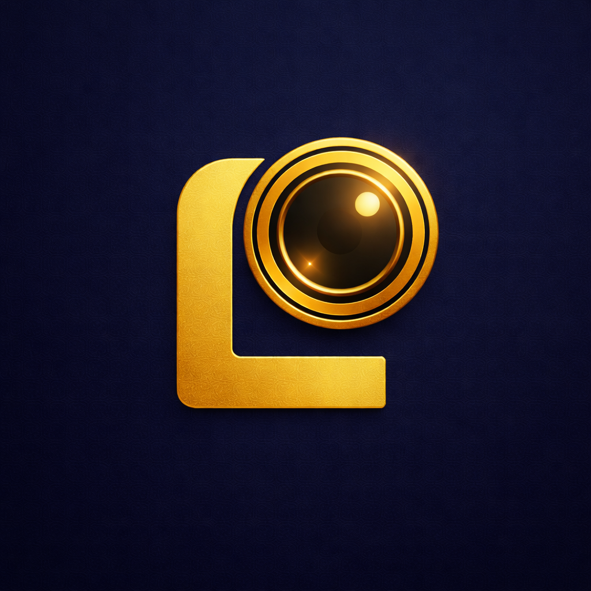

<div align="center">




# LORE

### The World Is Your Documentary

[](https://flutter.dev)
[](https://ai.google.dev)
[](https://deepmind.google/technologies/veo)
[](https://cloud.google.com/run)
[](https://cloud.google.com/vertex-ai)
[](LICENSE)

**[🌐 Live Demo](https://lore-landing-page-2we3jhrqzq-uc.a.run.app)**

Point your camera at any place. Speak any question. LORE generates a living documentary — narrated, illustrated, cinematic — in real time. History has never been this immersive.

*Built for the Gemini Live Agent Challenge 2026.*

</div>

---

## Modes

LORE offers four distinct ways to experience the world as a documentary.

### ✦ LoreMode — See + Ask = Something New.
Camera AND voice simultaneously. LORE sees where you are AND hears your question — then generates a response that fuses both. This unlocks Alternate History scenarios grounded in your real location.

- Simultaneous camera + voice input
- Gemini fuses visual context with spoken intent
- Alternate history scenarios grounded in your real backdrop
- The signature LORE experience

### 🎙️ VoiceMode — Speak. Ask. Receive a film.
Speak any topic and receive a fully interleaved documentary — narration, generated illustrations, and cinematic video clips — flowing together as a single coherent stream. Interrupt at any time to ask follow-up questions.

- Natural voice conversation with Gemini Live
- Automatic image generation after every visually rich narration
- Veo 3.1 cinematic video clips on demand
- Full session history with persistent chat

### 📷 SightMode — Point. See. Understand.
Point your camera at any monument or building and LORE instantly recognises it via Gemini Live vision and GPS grounding. It begins generating a narrated documentary with high-fidelity illustrations streaming in real time.

- Camera captures live frames at 1fps
- GPS context grounds the model to your exact location
- Gemini Live streams narration audio
- Gemini 3.1 Flash Image generates documentary-style illustrations

### 📍 GPS Tracking mode — Walk. Discover. Listen.
Experience the history of your city as you walk through it. LORE tracks your position and auto-triggers narrations when you approach a landmark. The live map view is screen-shared with Gemini every 5 seconds so it can see your route, surroundings, and active navigation. Includes full Google Directions navigation.

- Real-time GPS tracking with landmark detection
- Live map screen sharing with Gemini
- Auto-triggered narrations on significant movement
- Google Directions API for walking navigation
- Hands-free — the world narrates itself as you move

---

## Architecture


### Backend Services (Cloud Run)

| Service | Description | Port |
|---------|-------------|------|
| `lore-gemini-proxy` | WebSocket proxy to Gemini Live API — used by all 4 modes | 8090 |
| `lore-nano-illustrator` | HTTP image generation via Gemini 3.1 Flash Image | 8091 |
| `lore-veo-generator` | HTTP video generation via Veo 3.1 | 8092 |
| `lore-landing-page` | Static landing page served via nginx | 8080 |

### How it works

1. **Multimodal Capture** — Real-time camera frames and audio stream via WebSocket to the Gemini Live Proxy. Vision and voice are processed concurrently.
2. **Spatial Grounding** — GPS coordinates and reverse-geocoding provide location context, ensuring narration is grounded in physical reality.
3. **Tool Call Orchestration** — Gemini Live API triggers `generate_image` and `generate_video` tools, executed by the specialized backend servers.
4. **Real-time Delivery** — Interleaved audio, text, images, and video stream back to the mobile app.

### Mobile (Flutter)

```
screens/
  home_screen.dart           — mode selection
  lore_mode_screen.dart      — camera + voice + GPS → Gemini Live
  new_voice_mode_screen.dart — voice + image/video generation
  sight_mode_screen.dart     — live camera + audio → Gemini Live
  new_gps_mode_screen.dart   — GPS tracking + map screen sharing + Directions API

services/
  camera_service.dart        — camera frame capture
```

---

## Tech Stack

### Live Intelligence
| Model | Role |
|-------|------|
| `gemini-2.5-flash-native-audio-preview-12-2025` (AI Studio) | Real-time narration — vision + audio + session memory |
| `gemini-live-2.5-flash-native-audio` (Vertex AI) | Same, production grade with audio output |

### Generation Layer
| Model | Role |
|-------|------|
| `veo-3.1-generate-preview` | 1080p cinematic video generation |
| `gemini-3.1-flash-image-preview` | Rapid high-fidelity image generation |

### Spatial & Navigation
| Service | Role |
|---------|------|
| Google Maps SDK | Landmark visualisation and route rendering |
| Google Directions API | Walking navigation for GPS Walking Tours |

### Infrastructure
| Service | Role |
|---------|------|
| Google Cloud Run | Serverless compute hosting proxy and generation servers |
| Vertex AI | Production AI platform with ADC-based auth |
| Google Cloud Build | Container image builds |

---

## Quick Start

### Prerequisites

- Python 3.11+
- Flutter 3.x
- Google Cloud SDK (`gcloud`)
- A `GEMINI_API_KEY` from [AI Studio](https://aistudio.google.com/apikey)
- A Google Maps API key (for GPS mode)

### 1. Configure environment

```bash
cp .env.example .env
# Fill in GEMINI_API_KEY and GOOGLE_MAPS_API_KEY
```

### 2. Start backend services

```powershell
# Terminal 1 — Gemini Live proxy (required for all modes)
python backend/services/gemini_live_proxy/server.py

# Terminal 2 — Image server (SightMode, VoiceMode, LoreMode)
python backend/services/nano_illustrator/image_server.py

# Terminal 3 — Video server (VoiceMode)
python backend/services/veo_generator/video_server.py
```

### 3. Configure Flutter

Create `mobile/dart-defines.json`:

```json
{
  "GEMINI_PROXY_URL": "ws://10.0.2.2:8090",
  "GOOGLE_MAPS_API_KEY": "<your-maps-api-key>"
}
```

> Use your machine's LAN IP instead of `10.0.2.2` when running on a physical device.

### 4. Run the app

```bash
cd mobile
flutter pub get
flutter run --dart-define-from-file=dart-defines.json
```

---

## Reproducible Testing

### Easiest path — Install the pre-built APK (Android)

All backend services are live on Cloud Run. The APK connects to them automatically — no API keys or backend setup required.

1. **Download** `lore-v1.0.apk` from the [GitHub Releases](../../releases/latest) page.
2. On your Android device, enable **Settings → Install unknown apps** for your browser.
3. Open the downloaded APK and install.
4. Grant camera, microphone, and location permissions when prompted.
5. Open LORE and select any mode.

> GPS Tracking mode requires a physical device — emulator GPS is not reliable enough for landmark detection.

### Mode-by-mode test guide

| Mode | What to try |
|------|-------------|
| **VoiceMode** | Tap the mic and say *"Tell me about the Roman Colosseum"* — narration + illustrations + video should follow |
| **SightMode** | Point camera at any building and speak *"What is this place?"* |
| **LoreMode** | Point camera at any backdrop, speak *"What would this place look like in ancient Rome?"* |
| **GPS Mode** | Walk near any landmark — narration auto-triggers; tap a destination for walking directions |

### Build from source

If you prefer to build locally against the live backend:

```bash
# 1. Clone and install Flutter dependencies
cd mobile && flutter pub get

# 2. Create mobile/dart-defines.json pointing to live services:
cat > mobile/dart-defines.json << 'EOF'
{
  "GEMINI_PROXY_URL": "wss://lore-gemini-proxy-2we3jhrqzq-uc.a.run.app",
  "NANO_ILLUSTRATOR_URL": "https://lore-nano-illustrator-2we3jhrqzq-uc.a.run.app/generate",
  "VEO_GENERATOR_URL": "https://lore-veo-generator-2we3jhrqzq-uc.a.run.app/generate",
  "GCP_PROJECT_ID": "geminiliveagent-487800",
  "GOOGLE_MAPS_API_KEY": "<your-maps-api-key>",
  "GOOGLE_GENAI_USE_VERTEXAI": "true"
}
EOF

# 3. Run on a connected device
flutter run --dart-define-from-file=dart-defines.json
```

> A `GOOGLE_MAPS_API_KEY` is only required for GPS Tracking mode. The other three modes work without it.

---

## Cloud Deployment

### Proof of Cloud Deployment


- **[☁️ Cloud Deployment Proof (Video)](https://drive.google.com/file/d/1XUXpWj95vSaJuFwEia5FYDLE9AGGrUTd/view)**

### Bootstrap (first time only)

```powershell
.\infrastructure\scripts\bootstrap.ps1 -ProjectId <your-project-id>
```

### Deploy all services

```powershell
.\infrastructure\scripts\deploy.ps1 -ProjectId <your-project-id> -Vertex
```

### Deploy landing page

```powershell
.\landing-page\deploy-landing.ps1 -ProjectId <your-project-id>
```

### Deployed endpoints (production)

```
lore-gemini-proxy     wss://lore-gemini-proxy-2we3jhrqzq-uc.a.run.app
lore-nano-illustrator https://lore-nano-illustrator-2we3jhrqzq-uc.a.run.app/generate
lore-veo-generator    https://lore-veo-generator-2we3jhrqzq-uc.a.run.app/generate
lore-landing-page     https://lore-landing-page-2we3jhrqzq-uc.a.run.app
```

After deploying, rebuild the app:

```bash
cd mobile && flutter build apk --dart-define-from-file=dart-defines.json
```

### Cleanup (post-hackathon)

```powershell
# Deletes Cloud Run services and service account
.\infrastructure\scripts\cleanup.ps1 -ProjectId <your-project-id>

# Full teardown including GCR images and Cloud Build bucket
.\infrastructure\scripts\cleanup.ps1 -ProjectId <your-project-id> -Nuke
```

---

## AI Studio vs Vertex AI

LORE supports both modes. Switch by editing two files:

**`mobile/dart-defines.json`**
```json
{
  "GOOGLE_GENAI_USE_VERTEXAI": "true",
  "GCP_PROJECT_ID": "your-project-id"
}
```

**`.env`**
```bash
GOOGLE_GENAI_USE_VERTEXAI=true
```

> After changing `dart-defines.json` you must do a full rebuild: `flutter run --dart-define-from-file=dart-defines.json`

| Feature | AI Studio | Vertex AI |
|---------|-----------|-----------|
| Veo video with audio | ✗ | ✓ |
| Free tier | ✓ | ✗ |
| Production scale | ✗ | ✓ |
| Auth | API key | ADC / Service Account |

---

## Screenshots & Video Demo

### Video Demo
[](https://youtu.be/jkc9dAexUZs)

*(Click above to watch the video demo on YouTube)*

### Mobile Screenshots


---

## Roadmap: What's next for LORE

- **Branch Documentaries** — Tap any claim during narration to instantly branch into a sub-documentary on that topic, up to 3 levels deep.
- **Historical Character Encounters** — Converse with AI-powered historical figures at relevant locations (Marcus Aurelius at the Colosseum, da Vinci in Florence).
- **Chronicle Export** — Generate illustrated PDFs of any documentary session with citations, timestamps, and generated imagery.
- **Depth Dial** — Adjust content complexity from Explorer (casual) to Scholar to Expert (academic depth).
- **Multilingual support** — 24 languages with cultural adaptation.
- **App Store & Play Store release** — Bringing immersive history to everyone.

---

## License

This project is licensed under the MIT License - see the [LICENSE](LICENSE) file for details.

---

## Notes

- **GPS Tracking mode** requires a physical device — emulator GPS is unreliable.
- **Local dev** uses AI Studio by default. Do not set `GCP_PROJECT_ID` in `dart-defines.json` for local dev.
- The Maps API key appears in `AndroidManifest.xml` by design (required by Maps SDK) — restrict it by Android app signature in GCP Console.
- See [`SETUP.md`](SETUP.md) for the full deployment guide including Secret Manager setup and pre-publish checklist.
